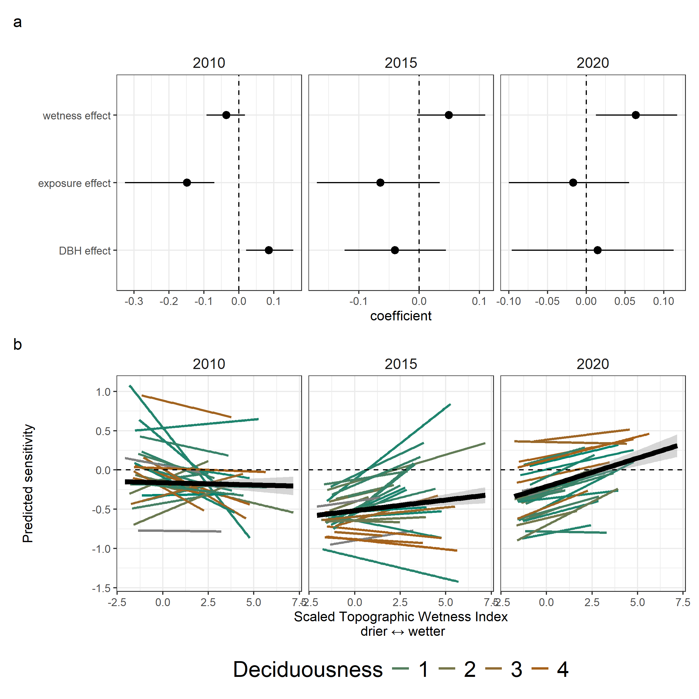

```{r setup, include=FALSE}
knitr::opts_chunk$set(echo = TRUE)


# Display items

## Tables


## Figures
fig_DAG <- 1

# Read in files
```


**Title:** Sensitivity of tree growth to drought in seasonally dry tropical forests using long-term dendrometer band measurements

**Authors**  
```{r eval = TRUE, echo=FALSE, warning=FALSE}
library(flextable)
set_flextable_defaults(font.family = "Arial", font.size = 9)
team <- read.csv("display/authors.csv", stringsAsFactors = FALSE, check.names = FALSE)

ft <- flextable(team)
ft <- line_spacing(ft, space = 1, part = "all")
ft <- autofit(ft)
ft <- width(ft, 1, width = 1.75)
ft <- width(ft, 2, width = 1.75)
ft <- width(ft, 3, width = 3)
ft
```


\newpage

# Summary {-}
<!-- 
New Phytologist Summary format
- Rationale  
- Methods  
- Key results   
- Main conclusion   -->

- Tropical tree woody growth has long-lasting impacts on the terrestrial carbon pool, but how climate anomalies might impact the growth of tropical tree growth is poorly understood. 
Standard methods like tree rings and plot inventories may either not represent most species or may not be accurate enough to capture variation in slow-growing species.  
- We used a unique data record - manual dendrometer band measurements over 15 years on 1820 trees across 30 species in a seasonally dry tropical forest in Huai Kha Khaeng, Thailand, along with species traits (deciduousness and maximum size), individual characteristics (crown exposure, size) and environment-related water availability to predict the sensitivity of tree growth to drought in two ENSO drought events with different characteristics - a wet-season drought and a dry season drought. 
We used Bayesian regressions in a causal modelling framework to predict variability among species and individuals in drought sensitivity.
- In the wet-season drought, deciduous species were more sensitive than evergreen species, especially in wetter microsites, while these patterns were not significant in the dry-season drought. 
After accounting for species differences, more exposed trees were more likely to be negatively impacted than their less exposed counterparts, with exposure showing clear negative impacts compared to size *per se*. 
- Large differences among species and individuals in their sensitivity to drought, as well as climatic differences differences among droughts themselves can explain heterogeneity in ecological responses to drought. 

# Keywords {-}

\newpage

# Introduction {-}

Tropical tree woody growth is a key component of aboveground productivity and affects the global carbon carbon cycle, but its sensitivity to climate anomalies is poorly understood.  
- Woody growth has long-lasting effects on the terrestrial carbon pool but is sensitive to interannual variation in temperature and precipitation.  
- Extreme events like drought, with temperature and precipitation outside normal ranges that can lead to growth reductions that varies across species and individuals [@bennett_larger_2015; @mcgregor_tree_2021].  
- the extent of this variation in drought responses is poorly understood.  
- with changing climate patterns across the global tropics, including novel climatic regimes [@dahinden_future_2017], there is a need to understand the drivers of this variation, to be able to predict and respond to forest responses to drought.   


Growth reductions from droughts are difficult to estimate reliably from whole-plot inventories.  
- Droughts are different but generally leads to low soil moisture, low water tables, vapour pressure, high temperature.
- Results in thermal stress, evaporative loss, leaf turgor loss, embolism/cavitation  High mortality and growth reductions across global forests, including the tropics  
- Inventory data are often not at annual scales; smooths over drought/no-drought period.  
- Reductions are often small (<1 mm), and difficult to detect with tape measurements.  


Tree species in seasonally dry forests have diverse allocation strategies and traits which can result in differential sensitivities to drought  
- Drought events can be different from each other, but generally lead to low soil moisture, low water tables, low vapour pressure and high temperature [@chitra-tarak_hydraulicallyvulnerable_2021].  
- Results in thermal stress on tissues, evaporative loss, leaf turgor loss and cavitation.  
- Species can be conservative or acquisitive in water and nutrient uptake; differential allocation to growth/survival.  
- Species with drought tolerant traits like deep roots, more negative turgor loss point and ... are more resistant to drought [@kunert_leaf_2021; @refs].  
- Some evidence that both understory and emergent species can have reduced survival during drought [@machado_forest_2023].  
- Deciduous species, with shorter duration with leaves can have acquisitive strategies during leaf on [@desouza_drought_2020].   
-  Strategies also affects species distribution with evergreen species covarying with soil moisture [@kunert_leaf_2021] and potentially affecting survival and growth.   
- Many hydraulic-related traits vary with tree height [ @vinod_thermal_2023], including the frequency of dry season deciduous leaf loss -- both within species and at the community level [@condit_ref; @meakem].  

 

Within species, size, exposure and location can affect sensitivity to drought.  
- Large trees tend to undergo greater growth declines during drought compared to smaller trees [e.g., @bennett_larger_2015; @mcgregor_tree_2021; @anderson-teixeira_joint_2022].   
- It remains poorly understood the extent to which this is shaped by tree size itself, crown exposure, water access, and traits that tend to covary with size (e.g., decidiousness) -- all of which interact to shape drought resistance (Fig. `r fig_DAG`).  
- There is theory and evidence that tree size itself matters.  
- Theoretically, we expect that greater height makes trees more vulnerable to drought based on the physics of hydraulic flow through a porous medium, as described by Darcy's law [@mcdowell_darcy_2015; @fernández-de-uña_role_inpress].
- Height... [see refs in @vinod_thermal_2023; @olson_plant_2018; @couvreurWaterTransportTall2018].
- As tree size increases, leaves exert lower control over hydraulic resistance [@wolfe_leaves_2023].
- @chen_hydraulic_2022  
- There is theory and evidence that crown exposure matters [ @vinod_thermal_2023;  @refs_in_ vinod_thermal_2023; @scharnweber_confessions_2019].
- Microclimate buffering leads to cooler, moister understory air [@vinod_thermal_2023].
- Soils under closed canopies would also be cooler during hot times of the year [@lembrechts_global_2022].
- Reduced evaporative demand would also make them moister, and this might be added to by hydraulic redistribution.
- Trees with exposed crowns suffered significant crown dieback at greater rates in the 2012-16 CA drought [@ma_tree_2023].  
- Water access....  
- Larger trees have larger root systems, but do not necessarily access deeper water [@ref_from_Panama]  
- Even when trees are accessing deeper water, this does not mean that they're in better shape during drought. Rather, trees that rely on regular access to deep water may be more vulnerable during severe droughts when those sources are depleted [@chitra-tarak_hydraulicallyvulnerable_2021].  
- indeed, there is evidence that trees near streams undergo greater growth declines [@mcgregor_tree_2021] and increases in mortality [@zuleta] during drought
- rather than necessarily helping during drought, water access will shape the size and traits of species living in habitat, with stream habitats tending to have larger trees [@ref] and more evergreen trees, and also their average growth rate 


<!---KAT framing---->

-High Crown exposure makes trees more vulnerable to drought, but drought deciduous habit or perennial water access allows them to escape this  
-Disentangling the effects of tree size, crown exposure, water access, and deciduousness on drought sensitivity  


Here we use a 14-year record of dendrometer band measurements in seasonally dry forest in Thailand to test the vulnerability of tropical tree growth to drought. We expect variation in drought sensitivity (growth in drought year/growth in a previous year with normal rainfall) across trees. We ask: i) How much do species vary in drought sensitivity of tree growth? What drives this variation ii) What drives variation among individuals in the sensitivity of growth to drought? We hypothesise that growth sensitivity....  

<!----KAT - wetter habitats have higher growth reductions - because used to more water---->

<!-- - **habitat** : water availability is a key driver of tropical tree growth [@wagner_water_2012]. 
- **leaf habit** : drought resistance is higher in deciduous species because of leaf strategies that minimise water loss during months of high vulnerability. Deciduous and evergreen species have differential sensitivity to drought [@desouza_drought_2020].    
- **tree size** : larger trees face higher risk of mortality during drought, as well as greater growth reductions [e.g., @bennett_larger_2015; @mcgregor_tree_2021; @anderson-teixeira_joint_2022].  
- **exposure** : trees with higher exposure because of their canopy position have lower drought resistance than trees with lower exposure due to the direct effects of temperature and vapour pressure deficit.  
- **competition** : trees in denser stands have lower drought resistance than trees in sparser stands because of more intense competition for groundwater. Differences in rooting depths could add complexities to this effect, however, we do not have direct measures that could test this effect.  
- **exposure x size** :  While larger trees are likely to have uniform high exposure, smaller trees can have high or low canopy position based on stand characteristics (stand density, presence of a canopy gap etc.) Drought resistance of smaller trees with high exposure is expected to be lower than that of trees with low exposure because of the direct influence of temperature and light that could lead to cavitation. (BCI light x size interaction in @rüger_growth_2011)  
- **leaf habit x exposure** : species canopy strategies along with their leaf habit could exacerbate or counteract drought vulnerability [@rahman_speciesspecific_2019]. Under high exposure, deciduous species are potentially more drought resistant than evergreen species, while the pattern could be less clear under low exposure.  
- **leaf habit x habitat** : tropical evergreen and deciduous species have different habitat preferences [@kunert_leaf_2021] that could affect their drought resistance.   
- **habitat x exposure** : trees with high exposure in upland habitats are expected to have lowest drought resistance because of the compounding influence of abiotic stressors.   -->

# Materials and Methods {-}

***Sites and data*** 

We analysed data from manual dendrometer band censuses from 2008-2023 in the Huai Kha Khaeng ForestGEO plot (15.6324 N, 99.217 E), in the Huai Kha Khaeng Wildlife Sanctuary, Uthai Thani, Thailand.
This is a 50-hectare plot in mixed deciduous tropical forest, with a mean annual temperature of 1400 mm and a strong dry season from November to April [@anderson-teixeira_ctfsforestgeo_2015].
The dominant canopy species are _Hopea odorata_, _Vatica harmandiana_, _Dipterocarpus alatus_ and _Tetrameles nudiflora_ and lower layers of the canopy are dominated by sub-canopy evergreen and deciduous species like _Saccopetalum linneatum_ and _Polyalthia viridis_. 
Long-term analysis of tree-ring data shows that tree growth at Huai Kha Khaeng has been influenced by temperature and rainfall [@vlam_temperature_2014].  

We used the late wet/early dry dendrometer band censuses to calculate annual growth for each tree. 
We used the raw window size measurements combined with the diameter at breast height (DBH) measurement at installation to calculate DBH at each census using standard equations [condit].
We removed measures with likely data entry errors because of misplaced decimals, potential misidentified bands (old band numbers that restarted after stopping) and large measurement outliers (> 3 standard deviations from the mean across all observations). 
We then calculated annualised increments for each individual for each year by finding the difference in increment from the previous year and adjusting for the number of days between measurements.
We repeated the same steps for annual tape measurements made on each dendrobanded tree at each census and removed dendroband measurements that had low agreement with these tape increments.  
Finally, we excluded trees with negative increments over the whole timeseries, and included only species that had at least 10 individuals, resulting in a final dataset of 1820 individuals across 30 species.

![***Figure 2: Growth increment timeseries and drought sensitivity*** across trees and species in the Huai Kha Khaeng ForestGEO plot. a) Median of annualised growth increments across species (colours) and the whole plot (black) from 2009 - 2022 from late wet/early dry season dendroband measurements. 2010 and 2015 were moderate and very strong ENSO events respectively. b) Dsitribution of drought sensitivity of tree growth across all individuals in the two drought years. For comments - https://github.com/forestgeo/growth-precip-thailand/issues/11](display/Fig2.png)

Combining this growth series with climatic information, we identified two drought years of interest - 2010 and 2015 - and calculated growth sensitivity for each tree to each drought as a growth anomaly from its mean annual increment.
We first calculated the mean annual increment for each tree as the mean of the annualised increments across the whole timeseries.
We then calculated sensitivity for each tree for each drought as 
$$
sensitivity_{i} = \frac{drought.year.increment_{i} - mean.annual.increment_{i}}{mean.annual.increment_{i}}
$$
By scaling the difference in increment to the mean annual growth of each tree, this metric allows us to compare across slow and fast growing individuals and species. 

Across all individuals in the plot, we calculated topographic wetness index for an expectation of the water availability across space based on the concavity/convexity of a location. 
We used a Digital Elevation Model from a 5 m x 5 m elevation layer collected at plot establishment.
We used the *whitebox* package in R [@wu_whitebox_2022; @lindsay_whitebox_2016a] to fill and breach this layer, calculate flow accumulation at each cell and then calculate TWI as $log_{e}\frac{As}{tan(slope)}$.
We defined tree size as the diameter at breast height (calculated from dendrometer band window measurement) at the previous census. 
We estimated crown exposure for each tree at each census using crown illumination index, an ordinal categorical variable from 1 to 5 (least to most exposed) measured at each dendroband census.

We calculated three species-level traits : deciduousness, maximum size and niche breadth and one variable for each tree - topographic wetness index and two variables for each tree at each census - starting size and canopy exposure. 
We defined deciduousness as the mean proportion of canopy loss at maximum loss across individuals in the species, with a score ranging from 1 to 4 where 1 is most evergreen and 4 is most deciduous. 
We used data published in @williams_deciduousness_2008 for the top 30 species. 
Out of these, data was unavailable for _Alphonsea ventricosa_, an evergreen species, and so we manually assigned it a deciduousness score of 1, in the middle of the evergreen range. 
An alternate measure of deciduousness is the duration spent at maximum crown loss.
This data was strongly correlated with the proportion of crown loss; we chose to use the proportion of crown loss because it was available for a larger list of species. 
At the species level, we also calculated the maximum size across all individuals in the plot as measured in the 2008 whole-plot census.
We calculated niche breadth as the standard deviation of TWI across all observed individuals of each species in the whole plot census in 2008. 


***Statistical methods***

We first modelled sensitivity as a simple random intercept model

$$
sensitivity \sim 1 + (1 | Species)
$$ 

We then used the predicted sensitivities from this model and tested their correlations with three species-level traits - deciduousness, maximum size and niche breadth using simple linear models.

To model the interactive effects of deciduousness on sensitivity, we modelled

$$
sensitivity \sim 1 + TWI + deciduousness + TWI:decidousness
$$

We then calculated predictions across all combinations of values from observed maximum to minimum of TWI and deciduousness within this dataset.

To further disentange the drivers of stem-level drought sensitivity, we modelled:

$$
sensitivity \sim DBH + CII + TWI + (DBH+CII+TWI | Species)
$$ 

We chose to model a species random effect on all slopes here to account for variation across species instead of specific traits which may have different effects with each of the variables.

All statistical analyses were performed using R (version). 
Mixed models were fit through Bayesian regressions using MCMC methods using the package _brms_ [REF].


# Results {-}

## Interannual growth variation and drought sensitivity {-}


## Variation in sensitivity among species {-}

## Variation among individuals {-}



# Discussion {-}


# Acknowledgements {-}

Huai Kha Khaeng forest monitoring team. 
Ekaphan Kraichak, Kanisorn Chowtiwuttakorn. 
Jose Medina-Vega, Valentine Herrmann, Eugenie Mas.
Smithsonian Institution Postdoctoral Fellowship.
ForestGEO Analytical Workshop, Asia 2024. 


# Competing interests {-}

# Author contributions {-}

# Data availability {-}

\newpage
# References  {-}

