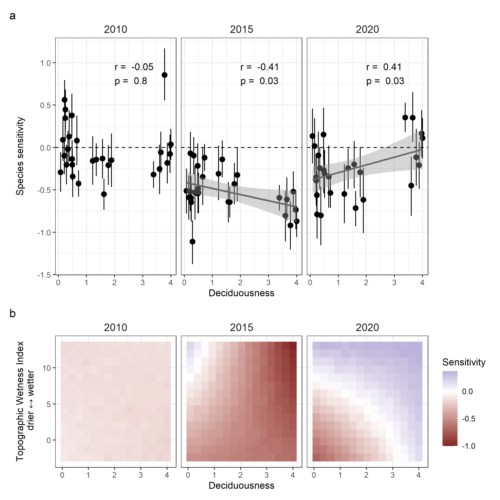
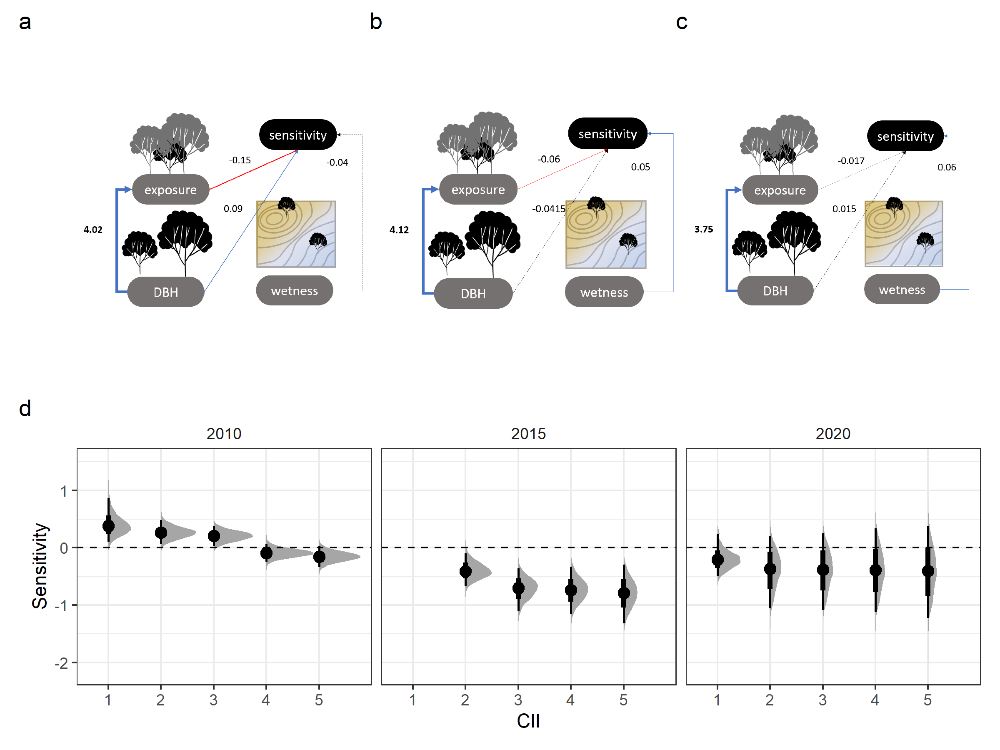

```{r setup, include=FALSE}
knitr::opts_chunk$set(echo = TRUE)


# Display items

## Tables


## Figures
fig_DAG <- 1

# Read in files
```

**Title:** Tropical tree drought sensitivity is jointly shaped by drought characteristics, species adaptations, and individual microenvironments

<!-- **Title 1:** Sensitivity of tree growth to drought in a seasonally dry tropical forest using long-term dendrometer band measurements

**Title 2:** Contrasting effects of species and environmental predictors on tree growth sensitivity to different/two droughts in a seasonally dry tropical forest

**Title 3:** Diversity of species- and environment-mediated drought responses in a seasonally dry tropical forest

**Title 4:** Long-term dendrometer band measurements reveal diverse species- and environment-mediated drought responses in a seasonally dry tropical forest

**Title 5:** Deciduousness may exacerbate/worsen/amplify tree growth sensitivity during wet season droughts in seasonally dry tropical forests -->

**Authors**  
```{r eval = TRUE, echo=FALSE, warning=FALSE}
# library(flextable)
# set_flextable_defaults(font.family = "Arial", font.size = 9)
team <- read.csv("display/authors.csv", stringsAsFactors = FALSE, check.names = FALSE)

# team <- read.csv("doc/display/authors.csv", stringsAsFactors = FALSE, check.names = FALSE)

# ft <- flextable(team)
# ft <- line_spacing(ft, space = 1, part = "all")
# ft <- autofit(ft)
# ft <- width(ft, 1, width = 1.75)
# ft <- width(ft, 2, width = 1.75)
# ft <- width(ft, 3, width = 3)
# ft
```

Krishna Anujan^1,2^*  ORCiD: `r team$ORCID[1]`  
Sean McMahon^2,3^  ORCiD: `r team$ORCID[2]`  
Sarayudh Bunyavejchewin^4^  ORCiD: `r team$ORCID[3]`  
Stuart J. Davies^3^  ORCiD: `r team$ORCID[4]`  
Helene C. Muller-Landau^3^  ORCiD : `r team$ORCID[5]`  
Nantachai Pongpattananurak^5^  ORCiD: `r team$ORCID[6]`  
Kristina Anderson-Teixeira^1,3^  ORCiD: `r team$ORCID[7]`  

**Affiliations:**

^1^SCBI
^2^SERC
^3^STRI
^4^National Park, Wildlife and Plant Conservation Department, Thailand
^5^Kasetsart University, Thailand

*=corresponding author

**Running title:**

**Article Type:** Letter
 
**Number of Words in Abstract:**  
**Number of Words in Main Text:**  
**Number of References:**  
**Number of Figures:** 5  
**Number of Tables:** 1  
**Number of Text boxes:** 0  

**Corresponding author address:** anujank@si.edu

# Keywords {-}

# Statement of Authorship {-}

# Data Accessibility Statement {-}

\newpage

# Abstract (150 words) {-}
The frequency and intensity of droughts are increasing across tropical forests, altering tree demography and its contribution to the land carbon sink. 
In seasonally dry forests, species adaptations to strong dry seasons might confer drought resistance, but this resistance may be variable with individual microenvironments and across drought events. 
We analysed a unique data record - manual dendrometer band measurements over 15 years on 1820 trees across 30 species in a seasonally dry tropical forest in <!---Huai Kha Khaeng, ---->Thailand, <!--using Bayesian regressions in a causal modelling framework--->to assess the drought sensitivity of tree growth in two climatically distinct droughts. 
Species and individuals exhibited a wide range of drought sensitivities within a drought event, and inconsistent responses across these two droughts. 
Deciduous species were more sensitive than evergreen species in the wet-season drought, and this difference was amplified in wetter microclimates. 
Although exposed trees were more sensitive, access to water through larger size or topographic location buffered growth declines. 
Heterogeneous responses of species and individuals to droughts indicate potential spatiotemporal insurance effects in diverse forests in the face of increased climate anomalies.

\newpage

# Introduction {-}

<!--KAT suggestion for new intro paragraph (would replace next paragraph)-->
In forests worldwide, intense drought is becoming more frequent, affecting forest demography, diversity, and  C cycling [@intergovernmentalpanelonclimatechangeipcc_climate_2023]. 
Understanding these impacts is an important research priority, particularly for tropical forests, which <!--harbor high species diversity and --> are critical C sinks; tropical tree woody growth removes roughly `r round (150*1/6,0)` Gt CO~2~ and offsets ~`r round(7/36.3*100,-1)`% of anthropogenic fossil fuel emissions [@beer_terrestrial_2010;@anderson-teixeira_carbon_2021;@anderson-teixeira_carbon_2016;@brando_droughts_2019].
Drought events can threaten this sink at different temporal scales; the 2015-2016 ENSO drought in the Amazon temporarily shifted the region from a net sink to a net source of carbon [@brando_droughts_2019].
However, the study of tropical tree woody growth responses to drought is inhibited by the fact that few tropical species form rings and long-term annual records are rare [@zuidema_tropical_2022]. 
We know that drought characteristics [], species traits, and microenvironment [@bennett_larger_2015;@mcgregor_tree_2021] all affect tree growth responses. 
However, we know little about their combined effects or potential interactions, which could fundamentally alter our understanding of forest responses to drought. 
<!--The above statement is true at least to my knowledge offhand, but we need to check--> 
Specifically, if drought tolerance is influenced independently by drought characteristics, species traits, and microenvironment, tree drought responses may be conserved, and therefore linearly predictable; for example, a species with low sensitivity to past droughts would be among the least sensitive species in any microhabitat and through any drought. 
In contrast, if these factors interact, the species and individuals that exhibit resistance to one drought may prove much more vulnerable in a different drought. 
The resultant amplification of the complexity and diversity of drought responses may act as a mechanism for promoting species diversity and stabilizing ecosystem function as drought regimes intensify [@dahinden_future_2017;@luo_tropical_2022].  

<!--PARAGRAPH ON IMPORTANCE OF DROUGHT, HOW OUR UNDERSTANDING REMAINS LIMITED, PARTICULARLY FOR SEASONAL TROPICAL FORESTS-->
<!-- Increasing drought risk is threatening demographic processes in global forests and consequently their consistent contributions to the land carbon sink [IPCC].   -->
<!-- - Every year, woody growth of trees in tropical forests removes roughly `r round (150*1/6,0)` Gt CO~2~ from the atmosphere [@beer_terrestrial_2010;@anderson-teixeira_carbon_2021;@anderson-teixeira_carbon_2016], contributing to a net biomass increase of ~7 Gt CO~2-eq~ [@harris_global_2021] that offsets ~`r round(7/36.3*100,-1)`% of anthropogenic fossil fuel emissions [@friedlingstein_global_2022].copied from our grant proposal - something like this is more specific and perhaps more compelling -->
<!-- - Moreover, woody growth has one of the longest residence times in terrestrial carbon pool, contributing to long-lasting impacts on carbon removal from the atmosphere [@yang_variations_2021; @muller-landau_patterns_2021].  
- However, tree growth is vulnerable to drought, the frequency and intensity of which are increasing across the much of tropics [@tao_increasing_2022]. <!--and there is some evidence that stand-level vulnerability is increasing [@luo_tropical_2022; @tao_increasing_2022].-->
<!-- 
- With changing climate patterns across the global tropics, emergence of novel climatic regimes like "very extreme droughts" in recent decades [@dahinden_future_2017; @luo_tropical_2022], there is an urgent need to understand the drivers of this variation, to be able to predict and respond to forest drought responses.   
 --> 

<!--PARAGRAPH ON DROUGHT CHARACTERISTICS-->
Drought characteristics can influence climatic drivers of tree growth and their timing, and affect drought sensitivity of tropical trees. 
Droughts are notoriously hard to define and encompass a variey of types based on the meteorogical/climatic variables affected [@slette_how_2019]. 
Here we define drought as hot/dry conditions anomalously departing from long-term means during any given time of year. 
<!-- Droughts are characterised by anomalously hot and/or dry conditions, but these can occur at any time during the seasonal phenology of tree growth.  -->
<!-- Tropical tree growth shows predictable seasonal patterns [@garcía-cervigón_climate_2020;@giraldo_tree_2023]; drought timing can interact with this growth phenology especially.  -->
Tree growth responses to drought timing can be more pronounced in seasonally dry tropical forests because of strong seasonality in climate and consequently on photosynthesis, allocation and growth (including dry seasons unfavourable to growth) [@garcía-cervigón_climate_2020]. 
(Here we distinguish dry season from drought with differences in peridicity; dry season represents hot/dry conditions that are periodic, annual and predictable, droughts are unpredictable and anomalous hot, dry conditions.) 
Seasonally dry tropical forests are also at thermal/water stress tolerance thresholds, making them more vulnerable to drought [@allen_will_2017], and leading to stand-level patterns of drought-associated water stress [@bauman_tropical_2022; @bennett_sensitivity_2023; @aguirre-gutiérrez_drier_2019]. 
Analyses to date have found that the woody growth of tropical trees <!--decreases with temperature[@zuidema_tropical_2022;@clark_annual_2010;@clark_annual_2021; @vlam_temperature_2014] and -->is particularly vulnerable to dry season precipitation[@zuidema_tropical_2022;@clark_annual_2010;@clark_annual_2021]; however, these analyses represent only a very limited set of tropical tree species and climates. 
Trees in seasonally dry tropical forests exhibit a mix of strategies - along a spectrum of conservative to acquisitive water-use - that support survival and growth despite strong seasonal hot/dry stress, which might confer differential advantages in drought conditions. 

<!--PARAGRAPH ON HOW SPECIES TRAITS (AND VARIATION) SHAPE DROUGHT RESPONSES-->
Trees in seasonally dry forests have strategies that span and interact across timescales to maximise growth and survival under periodic hot/dry conditions.  
- evolutionary timescales - e.g. dry season deciduousness   
- Deciduous species, with shorter duration with leaves can have acquisitive strategies during leaf on [@desouza_drought_2020].    
- Species with drought tolerant traits like deep roots, more negative turgor loss point and ... can be more or less resistant to drought [@kunert_leaf_2021; @chitra-tarak_hydraulicallyvulnerable_2021].   
- ecophysiological - e.g. negative TLPs, plasticity in deciduousness (root/shoot)
- These spectrum of species strategies in seasonally dry forests for demographic stability under hot dry seasons might have distinct consequences for sensitivity, based on drought characteristics.  

<!--PARAGRAPH ON HOW MICROENVIRONMENT SHAPES DROUGHT RESPONSES-->
Individual growth responses to drought can also depend on the specific microenvironments they experience that can lead to distict atmospheric and hydrological stresses with ecological consequences.  
- Larger trees suffer more growth declines during drought [@bennett_larger_2015], exposed crowns -> more thermal stress [@vinod_thermal_2023] although crown exposure -> more light -> more growth in normal years. 
- ecological timescales - e.g. distribution of trees in relation to wetness  
-  Species distribution of evergreen species covarying with soil moisture [@kunert_leaf_2021] and potentially affecting survival and growth.  
- Larger trees have larger root systems, but do not necessarily access deeper water [@ref_from_Panama]  
- Even when trees are accessing deeper water, this does not mean that they're in better shape during drought. Rather, trees that rely on regular access to deep water may be more vulnerable during severe droughts when those sources are depleted [@chitra-tarak_hydraulicallyvulnerable_2021].  
- indeed, there is evidence that trees near streams undergo greater growth declines [@mcgregor_tree_2021] and increases in mortality [@zuleta] during drought  
- Some of these adaptations may confer drought sensitivity and buffer stem growth declines during drought years, or conversely, may tradeoff with advantages in normal years, leading to a diversity of responses within a drought event.  
- Moreover, drought characteristics can positively or negatively interfere with these factors, leading to consistent or heterogenous sensitivities across drought events.  

<!--[from KAT: While all good content, I find this paragraph unnecessary/ distracting. If you'd really like to include content here, I'd work it into the methods.]
Given the diversity of factors that can influence drought sensitivity in seasonally dry tropical forests, sampling strategies need to effectively span this variation and have adequate precision.  
- Species with rings are few, represent specific strategy to water use and growth - and often affiliated to drier microenvironments.  
- Tape measurements can be representative (although often not annual), not enough precision; error for each tape measure is 1mm, error for growth is at least 2mm. (Median annual growth across trees in HKK is ~1.4 mm, deviation from annual growth needs more precision).  
- In sum, these methods may only be capturing the most dramatic effects - the most severe droughts that affect ring-forming species or produce large-enough declines in fast-growing individuals.  
- Methods need to capture species strategies, distributions across microenvironments, and be precise enough.  
- Manual dendrometer band timeseries can represent a wide range of species strategies with equipment precision necessary to detect signals. --> 

 <!-- Within species, size, exposure and location can affect sensitivity to drought.  
- There is theory and evidence that tree size itself matters.  
- Theoretically, we expect that greater height makes trees more vulnerable to drought based on the physics of hydraulic flow through a porous medium, as described by Darcy's law [@mcdowell_darcy_2015; @fernández-de-uña_role_inpress].
- Height... [see refs in @vinod_thermal_2023; @olson_plant_2018; @couvreurWaterTransportTall2018].
- As tree size increases, leaves exert lower control over hydraulic resistance [@wolfe_leaves_2023].
- @chen_hydraulic_2022  
- There is theory and evidence that crown exposure matters [ @vinod_thermal_2023;  @refs_in_ vinod_thermal_2023; @scharnweber_confessions_2019].
- Microclimate buffering leads to cooler, moister understory air [@vinod_thermal_2023].
- Soils under closed canopies would also be cooler during hot times of the year [@lembrechts_global_2022].
- Reduced evaporative demand would also make them moister, and this might be added to by hydraulic redistribution.
- Trees with exposed crowns suffered significant crown dieback at greater rates in the 2012-16 CA drought [@ma_tree_2023].  
- rather than necessarily helping during drought, water access will shape the size and traits of species living in habitat, with stream habitats tending to have larger trees [@ref] and more evergreen trees, and also their average growth rate---> 

<!--HYPOTHESIS PARAGRAPH-->
We hypothesize that tropical tree drought sensitivity is jointly and interactively shaped by drought characteristics, species adaptations, and individual microenvironments. 
We test this by examining individual tree growth during two ENSO drought years within a 14-year record of dendrometer band measurements in a seasonally dry forest in Thailand. 
Specifically, we test predictions that
i) both species and individuals respond differently to different droughts. 
ii) Deciduous species, which rely on wet seasons for growth, are particularly sensitive to wet season drought. 
iii) Exposed trees are more sensitive to drought, but water availability, either through larger size or topographic location, can buffer growth declines.

<!-- - **habitat** : water availability is a key driver of tropical tree growth [@wagner_water_2012]. 
- **leaf habit** : drought resistance is higher in deciduous species because of leaf strategies that minimise water loss during months of high vulnerability. Deciduous and evergreen species have differential sensitivity to drought [@desouza_drought_2020].    
- **leaf habit x exposure** : species canopy strategies along with their leaf habit could exacerbate or counteract drought vulnerability [@rahman_speciesspecific_2019]. Under high exposure, deciduous species are potentially more drought resistant than evergreen species, while the pattern could be less clear under low exposure.  
- **leaf habit x habitat** : tropical evergreen and deciduous species have different habitat preferences [@kunert_leaf_2021] that could affect their drought resistance.   -->


```{r table, echo=FALSE, warning=FALSE, message=FALSE}
# figure 0-----------------------------

# make a figure with summaries

library(flextable)
set_flextable_defaults(font.family = "Arial", font.size = 9)

sumtab <- read.csv("display/summary_table.csv", stringsAsFactors = FALSE, check.names = FALSE)


ft <- flextable(sumtab)
ft <- set_header_labels(ft,
  na = ""
)
ft <- hline(ft, i = c(1, 4, 7), part = "body")
ft <- line_spacing(ft, space = 1, part = "all")
ft <- autofit(ft)
# ft <- height(ft, height = 0.3)
ft <- bold(ft, i = c(1, 4, 7), bold = TRUE, part = "body")
ft <- width(ft, 1, width = 3.5)
# ft <- width(ft, 2, width = 1.75)
# ft <- width(ft, 3, width = 3)
ft
```

# Materials and Methods {-}

***Sites and data*** 

We analysed data from manual dendrometer band censuses from 2008-2023 in the Huai Kha Khaeng ForestGEO plot (15.6324 N, 99.217 E), hereafter "HKK", in the Huai Kha Khaeng Wildlife Sanctuary, Uthai Thani, Thailand.
This is a 50-hectare plot in mixed deciduous tropical forest, with a mean annual temperature of 1400 mm and a strong dry season from November to April [@anderson-teixeira_ctfsforestgeo_2015].
The dominant canopy species are _Hopea odorata_, _Vatica harmandiana_, _Dipterocarpus alatus_ and _Tetrameles nudiflora_ and lower layers of the canopy are dominated by sub-canopy evergreen and deciduous species like _Miliusa horsfieldii_ and _Polyalthia viridis_. 
Long-term analysis of tree-ring data shows that tree growth at Huai Kha Khaeng has been influenced by temperature and rainfall [@vlam_temperature_2014].  


In the HKK plot, metal dendrometer bands were installed in 2008 on 2353 trees across 152 species following standard protocol [@muller-landau_metal_2008]. 
Trees were selected were based on the relative abundance of species in the forest, with more individuals banded from the abundant species (ranging from 230 trees to 1 tree per species), and spanning the size and habitat distribution within the plot. 
On each tree, the dendrometer band was installed at 1.4 m from the ground, a height of 10 cm above the regular point of measure for the whole plot census (typically 1.3 m), except on irregular trunks or buttresses when they were shifted above. 
All dendrobands were censused two times a year - in the wet and dry season - typically in June and January. 
During the census, the size of the window opening along the band was measured using Mitutoyo digital callipers (least count = 0.01 mm) and the diameter of the tree at the dendrometer band was measured using standard DBH tape.  

Using the late wet/early dry dendrometer band censuses, we calculated annualised growth for each year for each tree. 
We first removed measurements with likely data entry errors because of misplaced decimals, potential misidentified bands (old band numbers that restarted after stopping) or misidentified individuals (individuals with conflicting metadata across censuses).
We used the raw window size measurements combined with the diameter at breast height (DBH) measurement at installation to calculate diameter at each dendroband census using standard equations that uses the chord across the measurement window to estimate the arc, assuming a circular cross section[condit].
Since this was dependent on the diameter measurement at installation, we used a direct measurement at the time of installation if it was available.
If the tape measurement at the first window size measurement was not available for any band, we excluded window size measurements until the first available diameter measurement. 
We then calculated annualised diameter increments for each individual for each year by finding the difference in diameter from the previous year ($inc = dia_{t} - dia_{t-1}$) and adjusting for the number of days between measurements ($inc_{annual} = inc * \frac{tdif}{365}$).
To ensure that the data did not smooth over multiple years, we excluded increment measures with missing values for $dia_{t-1}$ and then excluded large measurement outliers (> 3 standard deviations from the mean across all observations). 
We repeated the same steps using annual tape measurements made on each dendrobanded tree at each census and removed dendroband measurements that had low agreement with these annualised increments calculated from tape measurements.  
Finally, we excluded trees with negative increments over the whole timeseries, and included only species that had at least 10 individuals, resulting in a final dataset of 1820 individuals across 30 species.

![***Figure 2: Growth increment timeseries and drought sensitivity*** across trees and species in the Huai Kha Khaeng ForestGEO plot. a) Median of annualised growth increments across species (colours) and the whole plot (black) from 2009 - 2022 from late wet/early dry season dendroband measurements. 2010 and 2015 were moderate and very strong ENSO events respectively. b) Dsitribution of drought sensitivity of tree growth across all individuals in the two drought years. For comments - https://github.com/forestgeo/growth-precip-thailand/issues/11](display/Fig2.png)

***Drought years and characteristics***

Combining the growth timeseries from dendrometer band measurements with climatic information, we identified two drought years of interest - 2010 and 2015.
To identify drought years, we identified years with low plot-level growth rate and combined this with information on ENSO events that affected the landscape. 
We chose to identify the years starting from the timeseries, instead of directly using climate variables and their deviation because drought definitions vary widely, and drought characterisation of a year can vary based on the definition selected.
Moreover, broad definitions based on climate variables (often not measured at the location), may not capture ecological realities within the plot. 
Out of the two years with low plot-level growth, 2010 was a moderate ENSO event while 2015 was a very strong ENSO event. 
These years also corresponded with expert knowledge of major droughts that affected the region. 
We also note that we chose not to include 2020 in our analysis despite low growth, because a) declines in growth can occur due to various reasons which could have distinct ecological responses in species and individuals b) 2020 did not emerge as a drought year either in the examination of drought indicators or from expert knowledge.  

To characterise these two droughts, we used climate data from a weather station near the plot and publicly available climate data for the region. 
We used daily weather data collected from 2001 to 2019 at the Forest Fire Research Station [CHECK WHERE], located ~20 km from the ForestGEO plot. 
We first calculated daily values of Vapour Pressure Deficit using the equation $$
0.6108 * e^{17.27 * \frac{t_{max}}{t_{max}+237.3}}* (1-\frac{relative.humidity}{100})
$$
We then calculated rolling means of precipitation, number of dry days (precipitation = 0), VPD and maximum temperature over 15 day periods across the whole year for each year.
Finally, we calculated the long-term mean for each variable as the mean of the values of the rolling mean across all years of the dendroband measurements, and the standard error around this mean. 
We also used the SPEIbase dataset [REF] to calculate the Standardised Precipitation-Evapotranspiration Index, a drought severity index, calculated at the monthly scale. 
We report monthly SPEI for the two drought years along with long-term mean SPEI for each month.

***Variables for analysis***

For the two drought years, 2010 and 2015, we calculated growth sensitivity for each tree to each drought as a growth anomaly from its mean annual increment.
We first calculated the mean annual increment for each tree as the mean of the annualised increments across the whole timeseries.
We then calculated sensitivity for each tree for each drought as 
$$
sensitivity_{i} = \frac{drought.year.increment_{i} - mean.annual.increment_{i}}{mean.annual.increment_{i}}
$$
By scaling the difference in increment to the mean annual growth of each tree, this metric allows us to compare across slow and fast growing individuals and species. 

To account for potential biases in annual increments from dendrobands from water-related growth or shrinkage, we also calculated growth occurrence using a zero-growth assumption [@zweifel]. 
Under this assumption, positive DBH change is scored as 1 and any change <=0 is scored as 0. 
Timing of measurement and seasonal dynamics in tree hydration and bark dynamics could contribute to negative values in dendrometer band increments, unlike woody growth from tree ring datasets [@chitra-tarak]. 
To account for biases introduced by timing of measurements and seasonal dynamics, we used this simplifying assumption to corroborate the patterns observed with the sensitivity metric.

Across all individuals in the plot, we calculated topographic wetness index for an expectation of the water availability across space based on the concavity/convexity of a location. 
We used a Digital Elevation Model from a 5 m x 5 m elevation layer collected at plot establishment.
We used the *whitebox* package in R [@wu_whitebox_2022; @lindsay_whitebox_2016a] to fill and breach this layer, calculate flow accumulation at each cell and then calculate TWI as $log_{e}\frac{As}{tan(slope)}$.
We defined tree size as the diameter at breast height (calculated from dendrometer band window measurement) at the previous census. 
We estimated crown exposure for each tree at each census using crown illumination index, an ordinal categorical variable from 1 to 5 (least to most exposed) measured at each dendroband census.

We calculated three species-level traits : deciduousness, maximum size and niche breadth. 
We defined deciduousness as the mean proportion of canopy loss at maximum loss across individuals in the species, with a score ranging from 1 to 4 where 1 is most evergreen and 4 is most deciduous. 
We used data published in @williams_deciduousness_2008 for the top 30 species. 
Out of these, data was unavailable for _Alphonsea ventricosa_, an evergreen species, and so we manually assigned it a deciduousness score of 1, in the middle of the evergreen range. 
An alternate measure of deciduousness is the duration spent at maximum crown loss.
This data was strongly correlated with the proportion of crown loss; we chose to use the proportion of crown loss because it was available for a larger list of species. 
At the species level, we also calculated the maximum size across all individuals in the plot as measured in the 2008 whole-plot census.
We calculated niche breadth as the standard deviation of TWI across all observed individuals of each species in the whole plot census in 2008. 


***Statistical methods***

We first modelled sensitivity as a simple random intercept model

$$
sensitivity \sim 1 + (1 | Species)
$$ 

We then used the predicted sensitivities from this model and tested their correlations with three species-level traits - deciduousness, maximum size and niche breadth using simple linear models.

To model the interactive effects of deciduousness on sensitivity, we modelled

$$
sensitivity \sim 1 + TWI + deciduousness + TWI:decidousness
$$

We then calculated predictions across all combinations of values from observed maximum to minimum of TWI and deciduousness within this dataset.

To further disentange the drivers of stem-level drought sensitivity, we simultaneously modelled:

$$
sensitivity \sim DBH + CII + TWI + (DBH+CII+TWI | Species)
$$ 
and 
$$
CII \sim DBH
$$

Simultaneously modelling the effect of variables on sensitivity and the effect of DBH on CII in this way allows us to disentangle causual linkages between these processes. 
We chose to model a species random effect on all slopes here to account for variation across species instead of specific traits which may have different effects with each of the variables. 
However, we also ran simpler models with species random effects only on the intercept, the results of which are reported in the Supplementary Material. 
Across all models, we used Gaussian priors for the distribution of the response variable sensitivity, considered CII as an monotonic predictor (ordered factor) and centred and scaled the other predictors. 
We modelled CII as an ordinal categorical variable with a cumulative logit link function. 
In the combined form, the model therefore used a multivariate distribution of Gaussian and logit. 
<!-- Finally, to test full mediation effects, or the hypothesis that DBH effects on sensitivity are fully explained by its effects on exposure, we tested the same models, removing the DBH as a predictor of sensitivity. 
We then compared the fits of the partial mediation and full mediation models using Leave-One-Out Cross Validation.   -->

All statistical analyses were performed using R version 4.4.0 [@rcoreteam_language_2024]. 
Mixed models were fit through Bayesian regressions using MCMC methods using the package _brms_ [REF].
We ran 4 MCMC chains for 3000 iterations with 1000 of these set as warmup.
We extracted draws, calculated distributions using functions from the _posterior_ package [REF].


# Results {-}

## Drought characteristics {-}

The two droughts analysed had distinct temporal climatic characteristics, with 2010 primarily a dry season drought and 2015 a wet-season drought (Fig 1).
In 2010, drought characteristics of lower precipitation, higher number of dry days, higher maximum temperature, higher VPD than the long-term mean and SPEI values below -1 occurred between February and April, in the dry season. 
On the other hand, in 2015, similar deviations occurred in May and June, in the wet season. 
In 2015, SPEI in May was -2, an anomalously low value that was not observed in any month in the entire dendroband census time period, suggesting a severe drought. 

```{r data summaries, echo=F, warning=F, message=F}
library(tidyverse)
tree.time <- readRDS("../data/HKK-dendro/sensitivity_data_formodels.RData")
# tree.time <- readRDS("data/HKK-dendro/sensitivity_data_formodels.RData")


tree.time.sp <- tree.time %>%
  group_by(spfull) %>%
  dplyr::summarise(
    inc_annual_med = round(median(inc_annual, na.rm = T), 2),
    inc_annual_sd = round(sd(inc_annual, na.rm = T), 2)
  ) %>%
  arrange(inc_annual_med)

sens.sp <- tree.time %>%
  filter(yr %in% c(2010, 2015)) %>%
  group_by(spfull, yr) %>%
  dplyr::summarise(
    sens_med = round(median(sens.prop, na.rm = T), 2),
    sens_mean = round(mean(sens.prop, na.rm = T), 2),
    sens_sd = round(sd(sens.prop, na.rm = T), 2)
  ) %>%
  arrange(sens_med)

# spread this for each year

sens.sp.wide <- sens.sp %>%
  ungroup() %>%
  dplyr::select(spfull, yr, sens_med) %>%
  pivot_wider(names_from = yr, values_from = sens_med, names_prefix = "sens.")

# paired correlation of 2010 and 2015 sensitivities across species

sens.sp.cor <- cor.test(sens.sp.wide$sens.2010, sens.sp.wide$sens.2015)
```

## Drought sensitivity across distinct drought events {-}

The increment timeseries using dendrometer band measurements revealed plot- and species-level patterns in interannual growth variation (Fig 2a). 
Median annualised growth rate across the years of measurement for the whole plot was `r round(median(tree.time$inc_annual, na.rm=T),2)` $\pm$ `r round(sd(tree.time$inc_annual, na.rm=T),2)` cm. 
Median annual increment differed by species with *`r tree.time.sp$spfull[1]`* having the lowest (`r tree.time.sp$inc_annual_med[1]` $\pm$ `r tree.time.sp$inc_annual_sd[1]` cm) and *`r tree.time.sp$spfull[nrow(tree.time.sp)]`* the highest (`r tree.time.sp$inc_annual_med[nrow(tree.time.sp)]` $\pm$ `r tree.time.sp$inc_annual_sd[nrow(tree.time.sp)]` cm) among the `r nrow(tree.time.sp)` species analysed. 

Drought years were associated with lower growth across the plot. 
The drought year 2015 had the lowest median annual increment `r round(median(tree.time$inc_annual[tree.time$yr==2015], na.rm=T),2)` cm, `r round(-100*((median(tree.time$inc_annual[tree.time$yr==2015], na.rm=T)-median(tree.time$inc_annual, na.rm=T))/median(tree.time$inc_annual, na.rm=T)),2)`% lower than the median across all years. 
In 2010, the median annual increment was `r round(median(tree.time$inc_annual[tree.time$yr==2010], na.rm=T),2)` cm, `r round(-100*((median(tree.time$inc_annual[tree.time$yr==2010], na.rm=T)-median(tree.time$inc_annual, na.rm=T))/median(tree.time$inc_annual, na.rm=T)),2)`% lower than the median across all years. 
While there were more species differences in median responses to the 2010 drought, all species had lower increment than a typical year in 2015. 
Besides decrease in magnitude of growth, the proportion of trees with negative growth was also higher in the drought years. 
Across the years, on average, `r round(100*mean(tapply(tree.time$inc_annual, tree.time$yr, function(x) sum(x < 0) / length(x))),2)`% of the trees had negative growth, with a minimum of `r round(100*min(tapply(tree.time$inc_annual, tree.time$yr, function(x) sum(x < 0) / length(x))),2)`% in `r names(sort(tapply(tree.time$inc_annual, tree.time$yr, function(x) sum(x < 0) / length(x))))[1]`. The drought year 2015 had the maximum proportion of trees with negative growth in the timeseries, `r round(100*sum(tree.time$inc_annual[tree.time$yr==2015]<0)/nrow(tree.time[tree.time$yr==2015,]),2)`%.

Trees on average had negative drought sensitivities for both droughts with considerable variation around it (Fig 2b). 
Median drought sensitivity across all trees in 2010 was `r round(median(tree.time$sens.prop[tree.time$yr==2010]), 2)` $\pm$ `r round(sd(tree.time$sens.prop[tree.time$yr==2010]), 2)` while in 2015 it was `r round(median(tree.time$sens.prop[tree.time$yr==2015]), 2)` $\pm$ `r round(sd(tree.time$sens.prop[tree.time$yr==2015]), 2)`. 
In 2010, *`r sens.sp[sens.sp$yr==2010,]$spfull[1]`* and *`r sens.sp[sens.sp$yr==2010,]$spfull[nrow(sens.sp)/2]`* had the lowest and highest median sensitivity of `r sens.sp[sens.sp$yr==2010,]$sens_med[1]` and `r sens.sp[sens.sp$yr==2010,]$sens_med[nrow(sens.sp)/2]` respectively. 
In 2015, *`r sens.sp[sens.sp$yr==2015,]$spfull[1]`* and *`r sens.sp[sens.sp$yr==2015,]$spfull[nrow(sens.sp)/2]`* had the lowest and highest median sensitivity of `r sens.sp[sens.sp$yr==2015,]$sens_med[1]` and `r sens.sp[sens.sp$yr==2015,]$sens_med[nrow(sens.sp)/2]` respectively. 




```{r model summaries, echo=F, warning=F, message=F}
# load data--------------------------
datasets <- readRDS("../data/HKK-dendro/sensitivity_data.RData")

tree.time <- datasets$tree.time
tree_vars <- datasets$tree_vars
sp_vars <- datasets$sp_vars

colnames(sp_vars)[1] <- "Species"

coefs_df <- readRDS("../results/models/non_negative/sensitivity_model_intercept.RData")
ranef_df <- coefs_df %>% filter(grepl("r_Species", param))
ranef_df$Species <- gsub("r_Species\\[|\\,Intercept\\]", "", ranef_df$param)

# add intercept to ranef_df
# make intercept vector
intercepts <- coefs_df %>%
  filter(param %in% "Intercept") %>%
  dplyr::select(median) %>%
  pull(median)
intercepts <- rep(intercepts, each = nrow(ranef_df) / 2)
ranef_df <- ranef_df %>%
  dplyr::mutate(
    intercept = intercepts + median,
    lwr = intercepts + lwr,
    upr = intercepts + upr
  )

# plot intercepts against species characteristics

# join ranef_df with sp_vars
ranef_df <- merge(ranef_df, sp_vars, by = "Species", all.x = TRUE)

# lms
coefs_dec_lms <- ranef_df %>%
  # filter(yr %in% yrs) %>%
  filter(Species != "ALPHVE") %>%
  nest_by(yr) %>%
  # dplyr::mutate(mod = list(lm(intercept ~ williams_dec, data = data))) %>%
  dplyr::mutate(mod = list(cor.test(data$williams_dec, data$intercept))) %>%
  dplyr::reframe(broom::tidy(mod))


isocline_coefs <- readRDS("../results/models/non_negative/coefs_isoclines_nore.RDS")
# isocline_coefs <- readRDS("results/models/non_negative/coefs_isoclines_nore.RDS")

isocline_coefs <- do.call(rbind, isocline_coefs)
isocline_coefs_dec <- isocline_coefs %>% filter(param == "b_williams_dec")
isocline_coefs_twi <- isocline_coefs %>% filter(param == "b_twi")
isocline_coefs_inter <- isocline_coefs %>% filter(param == "b_twi:williams_dec")
# isocline_coefs_twi
# head(isocline_coefs)

coefs_spre <- readRDS("../results/models/orderedcii/coefs_rel_spre.RDS")
# coefs_spre <- readRDS("results/models/orderedcii/coefs_rel_spre.RDS")
coefs_df_spre <- do.call(rbind, coefs_spre)
coefs_spre_twi <- coefs_df_spre %>% filter(param == "b_sensprop_twi_scaled")
# head(coefs_spre_twi)
```


## Predictors of species-level variation in drought sensitivity {-}

Deciduousness was associated with lower negative sensitivities in 2015, but not in 2010 (Fig 3a). 
Species median sensitivities in 2010 and 2015 were not correlated with each other (Pearson's correlation coefficient r = `r round(sens.sp.cor[4]$estimate, 2)`, p = `r round(sens.sp.cor[3]$p.value,2)`) but on average had lower mean and median sensitivities in 2015 than in 2010, in alignment with median sensitivities across all trees. 
In 2015, predicted sensitivities from intercept-only models of sensitivity with a species random effect on the intercept showed a significant negative association with deciduousness value (r = `r round(coefs_dec_lms$estimate[coefs_dec_lms$yr==2015], 2)`, p = `r round(coefs_dec_lms$p.value[coefs_dec_lms$yr==2015], 2)`). 
On the other hand, in 2010, predicted sensitivities had no significant association with deciduousness (r = `r round(coefs_dec_lms$estimate[coefs_dec_lms$yr==2010], 2)`, p = `r round(coefs_dec_lms$p.value[coefs_dec_lms$yr==2010], 2)`). 
Moreover, models of all trees with TWI and deciduousness as predictors showed that the conditional effect of deciduousness on sensitivity (controlling for topographic wetness) was significant and negative in 2015 (`r round(isocline_coefs_dec$median[isocline_coefs_dec$yr==2015],2)`; 90% CI `r round(isocline_coefs_dec$lwr[isocline_coefs_dec$yr==2015],2)`, `r round(isocline_coefs_dec$upr[isocline_coefs_dec$yr==2015],2)`) but not in 2010 (`r round(isocline_coefs_dec$median[isocline_coefs_dec$yr==2010],2)`, 90% CI `r round(isocline_coefs_dec$lwr[isocline_coefs_dec$yr==2010],2)`, `r round(isocline_coefs_dec$upr[isocline_coefs_dec$yr==2010],2)`).  

The effect of TWI on sensitivity was different in 2010 and 2015, with 2015 effects interacting with deciduousness. 
Across all trees, the model with TWI and deciduousness showed that TWI had no effect on drought sensitivity in 2010 (median effect =`r round(isocline_coefs_twi$median[isocline_coefs_twi$yr==2010],2)`, 90% CI `r round(isocline_coefs_twi$lwr[isocline_coefs_twi$yr==2010],2)`, `r round(isocline_coefs_twi$upr[isocline_coefs_twi$yr==2010],2)`) but a positive effect in 2015 (median effect =`r round(isocline_coefs_twi$median[isocline_coefs_twi$yr==2015],2)`, 90% CI `r round(isocline_coefs_twi$lwr[isocline_coefs_twi$yr==2015],2)`, `r round(isocline_coefs_twi$upr[isocline_coefs_twi$yr==2015],2)`). 
The interaction between TWI and deciduousness was not significant in 2010 (median effect =`r round(isocline_coefs_inter$median[isocline_coefs_inter$yr==2010],2)`, 90% CI `r round(isocline_coefs_inter$lwr[isocline_coefs_inter$yr==2010],2)`, `r round(isocline_coefs_inter$upr[isocline_coefs_inter$yr==2010],2)`) but was significantly negative in 2015 (median effect =`r round(isocline_coefs_inter$median[isocline_coefs_inter$yr==2015],2)`, 90% CI `r round(isocline_coefs_inter$lwr[isocline_coefs_inter$yr==2015],2)`, `r round(isocline_coefs_inter$upr[isocline_coefs_inter$yr==2015],2)`).
Combined, predicted sensitivities of deciduous trees was more negative than evergreen trees in 2015, with this effect stronger in wetter sites (Fig 3b). 

The opposite effects of TWI on sensitivity in the wet and dry season drought, and the influence of deciduousness was also confirmed by models that controlled for crown exposure and size as well as species variation in intercept and slopes (Fig 4a). 
These models showed small negative sensitivities in wetter sites in the dry season drought (median effect =`r round(coefs_spre_twi$median[coefs_spre_twi$yr==2010],2)`, 90% CI `r round(coefs_spre_twi$lwr[coefs_spre_twi$yr==2010],2)`, `r round(coefs_spre_twi$upr[coefs_spre_twi$yr==2010],2)`), but strong positive effect of wetness in the wet season drought (median effect =`r round(coefs_spre_twi$median[coefs_spre_twi$yr==2015],2)`, 90% CI `r round(coefs_spre_twi$lwr[coefs_spre_twi$yr==2015],2)`, `r round(coefs_spre_twi$upr[coefs_spre_twi$yr==2015],2)`). 
The positive effect of TWI in 2015 was, however, mainly due to the response of evergreen species; deciduousness had a significant negative correlation with the slopes of the TWI effect in 2015 (Fig 4b). 
Predictions across the range of observed variables also showed that deciduous species generally had larger negative sensitivities in 2015, which did not show increase with wetness (Fig 4c). 
On the other hand, neither the mean sensitivities across species nor their response to TWI was associated with deciduousness in 2010.  


```{r exposure models, echo=F, warning=F, message=F}
coefs_spre_cii <- coefs_df_spre %>% filter(param == "bsp_sensprop_mocii_min1")
coefs_spre_ordcii <- coefs_df_spre %>% filter(param == "b_orderedciimin1_calcDBH_min1_scaled")
```

## Predictors of stem-level variation in drought sensitivity {-}

Crown exposure was associated with stronger negative sensitivities in both droughts.
In the same models with species random effects on intercept and slope, the simplex parameter for the ordered factor crown exposure in 2010 was significant and negative (median effect =`r round(coefs_spre_cii$median[coefs_spre_cii$yr==2010],2)`, 90% CI `r round(coefs_spre_cii$lwr[coefs_spre_cii$yr==2010],2)`, `r round(coefs_spre_cii$upr[coefs_spre_cii$yr==2010],2)`), while in 2015 the negative effect was not as strong (median effect =`r round(coefs_spre_cii$median[coefs_spre_cii$yr==2015],2)`, 90% CI `r round(coefs_spre_cii$lwr[coefs_spre_cii$yr==2015],2)`, `r round(coefs_spre_cii$upr[coefs_spre_cii$yr==2015],2)`). 
Predicted effects of crown exposure on sensitivity decreased monotonically, with a decrease to negative sensitivities in category 4 and 5 in 2010, but all crown exposure categories had negative sensitivities in 2015 (Fig 5b).

Accounting for effects of exposure, remaining effects of size on sensitivity differed between the two droughts. 
DBH was a significant predictor of exposure category, with larger DBH associated with higher exposure categories in 2010 (median effect =`r round(coefs_spre_ordcii$median[coefs_spre_ordcii$yr==2010],2)`, 90% CI `r round(coefs_spre_ordcii$lwr[coefs_spre_ordcii$yr==2010],2)`, `r round(coefs_spre_ordcii$upr[coefs_spre_ordcii$yr==2010],2)`) and 2015 (median effect =`r round(coefs_spre_ordcii$median[coefs_spre_ordcii$yr==2015],2)`, 90% CI `r round(coefs_spre_ordcii$lwr[coefs_spre_ordcii$yr==2015],2)`, `r round(coefs_spre_ordcii$upr[coefs_spre_ordcii$yr==2015],2)`) (Fig 5a). 
Controlling for this direct effect of exposure, the effect of exposure, the remaining effect of size *per se* was significantly positive in 2010, while it was weakly negative in 2015 (Fig 4a, Fig 5a). 




# Discussion {-}

<!---CONCLUSIONS---->
We show strong evidence that tropical tree drought sensitivity can be jointly and interactively shaped by drought characteristics, species adaptations and local environmental conditions (Table 1).
Analysing two droughts in a 14-year dendrometer band timeseries, we found that tropical tree species and individuals grew less than average in drought years, reflecting in lower plot-level growth (Fig 2).  
Comparing across droughts, we found that despite the shorter duration of drought conditions, the wet-season drought elicited stronger responses across trees, but especially so for deciduous species that are expected to have stronger seasonality in growth phenology.  
Interestingly, in the wet-season drought, we also show that evergreen and deciduous species had divergent responses along a wetness gradient; evergreen trees fared better and deciduous species suffered worse declines in wetter sites.  
Further, besides consistent negative effects of crown exposure, we found that the drivers of variation among species and individuals in drought sensitivity were dissimilar between the drought events. 
Water availability buffered exposure-associated growth declines through different mechanisms in the two different droughts - larger trees (with likely deeper roots) in the dry-season drought and trees in wetter sites in the wet-season drought suffered smaller declines in growth.  
Taken together, our analysis of tree growth in two different drought years, and spanning meaningful variation, shows that species and individuals can respond differently to different drought events.  
Despite stand-level growth declines in drought years, we show that these broad patterns mask enormous heterogeneity in individual and species responses to drought in tropical forests with possible consequences for the maintenance of species diveristy and ecosystem stability.   

<!----Limitations in filling gap---->
Although our analysis spans representative spatial and ecological variation, we are limited in quantitatively analysing differences among droughts and variation in drought characteristics, because of low sample size.  
-   Our analysis spans ecological and spatial/environmental variation realistic to tropical trees, and beyond previous such analyses.
- But given the relative shorter duration of the timeseries, the effort required to collect these data, and the unpredictability of drought events, our analysis only included two specific droughts.
- Thus, quantitative analyses parsing out the specific effects of drought characteristics like relative influence of timing and degree of anomaly is currently impossible, limiting interpretations.  
- However, as the record continues to grow, so does the potential to answer these questions.  

<!-- ALT: We analysed species traits as static, but we might be missing intraspecific and plastic variation in drought sensitivity traits, as well as other axes of trait variation that might explain variation in drought sensitivity.
- Many hydraulic-related traits vary with tree height [ @vinod_thermal_2023], including the frequency of dry season deciduous leaf loss -- both within species and at the community level [@condit_ref; @meakem].  *caveat for species-level traits*  
- While leaf deciduousness was the main axis of hydraulic conservative strategy that we considered, leaf-level stomatal regulation and belowground root loss etc. are other potential strategies for conservative water use, and our interpretation of species patterns may be limited by our understanding of these processes across species.  
- Surprisingly, although deciduousness may have had an advantage in the dry season drought, because this strategy -> conservative water use in the dry season, species differences in this drought were not predicted by deciduousness.   -->


<!----Limitations in generalisation---->
<!-- ALT: Differential allocation to growth may not mean negative outcomes, it might mean demographic trade-offs
- Differences in allocation to growth may not be the complete picture - may have altered allocation to mortality or reproduction.  
- Some evidence that both understory and emergent species can have reduced survival during drought [@machado_forest_2023].  *for where else might they be allocating to?*
- 2015 ENSO drought changed regeneration dynamics in Thailand [@nutiprapun_effects_2023]
- also NSCs and then compensatory growth
- deciduous species have higher survival under multi-year droughts [@aguirre-guiterrez refs] -->


Tropical dry forests also represent periodic hot/dry conditions, leading to adaptations or other genetic variation for resistance, but this might not hold in other bioclimatic zones where ecological variability is different.  
- Trait variation across forest and bioclimatic types
- Careful interpretation across forest types with different adaptive pressures.  
- However, some generalisation is possible because despite low seasonality in climatic conditions, everwet forest species also show seasonal growth patterns.   

<!----Contributions beyond---->
Despite consistent growth declines at the plot level across drought events, we show that this scale obscures a variety of ecological responses at the species and tree level that are heterogeneous across drought events.  
- Our finding that a wet season drought had bigger impact calls into question the generality of the findings of @zuidema_tropical_2022, which found that in species with tree-ring chronologies, dry season drought was most impactful. However, care must be taken in interpretation, as the 2015-16 ENSO was stronger. 
- Influence of deciduousness was different in the two different droughts. 
- *Afzelia xylocarpa*, one of the tree ring species had the most distinct (positive) sensitivity in the dry season drought, but a large negative sensitivity in the wet season drought - one of the most distinct responses.  
- More generally, tree ring and census estimates of drought sensitivity in seasonally dry tropical forests may be biased towards fast growing (measurable using tape) or dry-associated species (that form annual tree rings) - which might have been capturing only the more dramatic effects.
- Distinct responses of species and individuals to drought characteristics suggests potential spatiotemporal insurance effects among tropical tree response to drought.  

<!----Science is better now---->
Drought sensitivity is often defined as a static species trait but we show dimensions beyond that with possible consequences for management and restoration 
- Although net decrease at the plot level (agreement with landscape-scale in @aguirre-guiterrez), we show evidence that the same strategies are not uniformly successfully across spatiotemporal climatic variation.  
- Frameworks that include ecological complexity and covarying traits with environment like @trugman_why_2021 also assume individual trees to have consistent sensitivity across events, but our results demonstrate temporal dimensions of variation, at least partially attributable to drought characteristics.  
- Our results indicate that drought responses in tropical trees may not be a fixed response across events, but jointly shaped by...
- Given these inconsistencies, diverse stands that may represent greater variation in ecological and evolutionary strategies, may have mechanisms for stable functioning under future droughts.  


<!---Other points--->

- (BCI light x size interaction in @rüger_growth_2011)  


# Acknowledgements {-}

Huai Kha Khaeng forest monitoring team.  
Ekaphan Kraichak, Kanisorn Chowtiwuttakorn.  
Jose Medina-Vega, Valentine Herrmann, Eugenie Mas. 
Smithsonian Institution Postdoctoral Fellowship. 
ForestGEO Analytical Workshop, Asia 2024. 


# Competing interests {-}

# Author contributions {-}

# Data availability {-}

\newpage
# References  {-}

