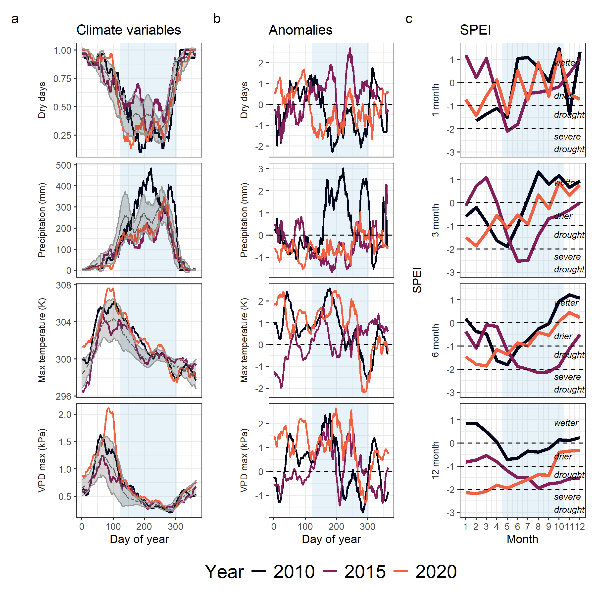

**Title:** Drought response is not a species trait: tropical tree drought sensitivity is shaped by drought characteristics, species adaptations, and individual microenvironments

Referees' comments to the author(s):

Referee: 1

Comments for the Authors  
General comment

The response of tropical forests to drought is a central topic in global ecology and climate change, directly aligned with the interests of Ecology Letters. The novel of this work is the central argument that drought sensitivity is not a fixed species trait, but rather the result of the interaction between drought characteristics, adaptations, and the microenvironment, provides conceptual originality. The authors used a 14-year series of dendrometer bands in a big plot with 1,820 trees of 30 species, which is a high-value dataset. In addition, the statistical analysis based on Bayesian models and a causal framework to disentangle trait, size, and microenvironment effects appears to be a sufficiently robust approach to address predictions. However, I have some concerns regarding the with the current version that should be addressed by the authors, which are appointed below.

**RESPONSE: Thank you for your favourable review of the manuscript and for the constructive comments. We have now revised the manuscript based on these suggestions and that of the other reviewer which have helped improve the mansucript. Our detailed comments are below.**

Main comments: 

•	It is always helpful to know the study site. I recommend including some pictures of the forest and study area.

RESPONSE:

•	The methodology should clearly state whether the 30 species selected for the study represent the functional groups. It should include the number of species per Deciduousness group.

**RESPONSE: Thanks for this comment. We agree that it is useful to include the functional representativeness of the species. As we mention in the methods, our metric of deciduousness is a continuous variable and not categorical. And so, reporting the number per deciduousness group would require arbitrarily discretising this continuous variable. Instead, we now report a supplementary figure showing the distribution of deciduousness among the selected species.**

•	I think it is important to add the average of non-dry years in Figure 1a (without 2010, 2015 and 2020). This helps clarify the difference between a normal/rainy year and a dry year.

**RESPONSE: Thanks for this comment. We have now included the long-term mean trend along with the long-term standard deviation to for Fig 1a to show the deviation more clearly. Fig 1b now follows more closely, showing the deviation in SD units from the long-term mean.**

•	It confuses many acronyms. It's necessary to rewrite their description at least once in the results section, e.g. CII doesn't appear in this section.

**RESPONSE: We have now carefully reviewed the text and rewritten the description of acronyms (TWI and CII) in the results section to make it clearer for readers.**

•	Predictions (i–iii) are clearly formulated, but the Results section is at times overly dense with statistical detail. It would be helpful to present more explicitly which findings support each hypothesis.

**RESPONSE: Thanks for this suggestion. We have now revised the Results section to remove some redundant statistical details that are reported in figures. We have also reorganised some text so that the statements that correspond to each prediction are highlighted at the start of each section. We hope that the results and their alignment with the predictions are clearer now.**

•	276: This section is important, but it's not a relevant result; rather, it's a methodological aspect that allowed the study to be conducted. I think it should be included in the materials and methods section.

**RESPONSE: Thanks for this suggestion. We have now moved the description of the droughts to the methods section and have only retained a brief description of the differences among droughts in the results.**

•	Since the study is based on only one site, it is relevant to improve the discussion section with other already published study sites (add more references), mainly link the global implications, such mortality rate and vulnerability in tropical forests. See https://urldefense.proofpoint.com/v2/url?u=https-3A__doi.org_10.1126_science.adq6607&d=DwIFaQ&c=009klHSCxuh5AI1vNQzSO0KGjl4nbi2Q0M1QLJX9BeE&r=6fH468T58at0TtM59sMf109A_dRgo6XTfGMOVX5Ewrw&m=fPE_4y1UPsTl9St_Y44IUO7VIaQJOJIUiHtK15-Nr7g4UiVKbtYQ-TE0043SLAj6&s=SxqVZgFkbqAZ0-VEvdQntXWpGEUu9lr25rgxQtwaVdw&e=

*RESPONSE: Thanks for this suggestion. We were excited to see this global study published recently. We have now discussed our focused work in relation to this global study based on the alignment of the a key message - the diversity of drought responses with drought types and species traits (deciduousness). However, dendroband datasets can be key to filling gaps in spatial and climatic coverage of tree rings records in the tropics (reviewed by @groenendijk_importance_2025). Moreover, our results showcasing response diversity among individuals within a species demonstrates an important caveat to aggregate/species-chronology-based inferences from tree-ring records.*

•	There was something missing to discuss about the species in particular, some that have been more affected than others and why, especially those in conservation categories. 

**RESPONSE: Thanks for this suggestion. We have now included a supplementary table (Table S1) that details the response of specific species to specific drought events. This summary highlights our main message that the species responses are dissimilar across drought events. This table also includes available information on the IUCN categories of the species analysed (accessed in September 2025) where information was avaialable. Two of the species analysed are "Endangered", including *Afzelia xylocarpa*, the species that was discussed. There are also "Vulnerable" and "Data Deficient" species in the list, some of which have consistent negative drought sensitivities. This table would therefore be useful for forest managers and conservation professionals and to guide species-specific research directions. We have also added a line highlighting the contrasts between species responses in the discussion, which now reads:**

"An important implication is that drought responses inferred from tree-ring records derived from the few species known to form reliable, dateable annual rings (n=4 at HKK; @vlam_temperature_2014) are unlikely to be representative of the drought responses of the entire community.
For example, one of the few annual-ring-forming species at HKK, deciduous *Afzelia xylocarpa*, had the most distinct response across the three events; it's growth nearly doubled in the 2010 and 2020 droughts but was severely reduced in the wet-season drought (Fig. S5, Table S1).
Extrapolating from these could lead to erroneous inferences on species with conservation or commercial significance, e.g. *Dipterocarpus alatus* which presents a different drought response (Table S1)."

**As to why different species might be responding differently, a key difference could be their evolutionary strategies along hydraulic safety vs. efficiency. 
We have discussed our results in light of deciduousness as an example.
However, we recognise that many other above and belowground traits may contribute to these differences and need to examined further.
We have edited text in the discussion to read:**

"Paralleling the rarity of long-term records of annual tree growth in less seasonal tropical forests [@zuidema_tropical_2022], we know exceedingly little about how tropical tree species with different above- and below-ground traits along the hydraulic safety-efficiency spectrum respond to different types of drought, and how these responses may be modified by microenvironments."

•	It is necessary to discuss further why the results indicate a "spatiotemporal insurance", which ecophysiological mechanisms or processes are relevant in these tropical forests.

**RESPONSE: Thanks for this suggestion. Our conclusion here was based on the fact that both species and individuals within species (spatial) seem to have little similarity in their responses to different droughts. At the community/stand level, these could be either because of adaptive differences among species or environmental differences among sites that interact with different drought types. Upon further discussion, we think that the term "biological insurance" (*sensu* @loreau_biodiversity_2021) may be more appropriate here given its more general definition and inclusion of both species and spatial concepts of insurance. We have now revised the usage of this term in the manuscript and included a reference to this framework.**

Minor comments: 

55: Could you briefly explain the three climatically distinct droughts?

**RESPONSE: The three climatically distinct droughts are summarised in Table 1. In summary, 2010 was a moderate drought that peaked in the dry season, 2015 was a severe drought that peaked in the wet season and 2020 was a moderate drought that peaked in the transition from dry to wet season. After moving the drought descriptions to the methods section, we have added this summary to set context for the results section.**

162-163: Until when was the measurement? It is important to add the last year of measurement.

**RESPONSE: Our analysis includes measurements until January 2023, making 2022 the last growing year considered. We have now added this detail. It now reads:  
"Using the late wet/early dry dendrometer band censuses (centred around January), we calculated annualised growth for each tree and year from 2009 to 2022."**

239-242: I think that this extra information is unnecessary, since although this measurement is interesting, it was not the one applied in this study.

**RESPONSE: We have now removed this statement regarding the alternate measure of deciduousness that was considered.**

301-307: The figure that supports this paragraph needs to be cited. I would think it would be figure 2a, but the species Gluta obovata is not there. I did not see the analysis by dominant species anymore, if the study does not focus on these species, I recommend removing it from Figure 2 since it confuses the reader.

**RESPONSE: Thanks for this comment. We have revised Figure 2 to remove species lines. Originally, we had chosen to include the top 10 species in the plot to illustrate both synchrony and divergence in species responses, but the results text reported on growth and sensitivity values across all species considered (n=30), shown in the Supplementary Appendix. We agree that this misalignment in species choice was confusing and have removed it from Figure 2 and referenced the relevant figure in the results text.**

339-346: I had a hard time understanding this result, on the one hand it says that Crown exposure was associated with greater growth declines in 2010, but not for 2015 and 2020. However, according Fig 5b all all crown exposure categories had negative sensitivities in 2015 and 2020. 

**RESPONSE: Since all crown exposure categories had negative growth sensitivities in 2015 and 2020, crown exposure was not associated with large differences in the magnitude or direction of sensitivity. In other words, more exposed trees had more or less similar growth declines compared to less exposed/understory trees. We have now clarified this in the text which now reads:**

"Predicted effects of CII on sensitivity decreased monotonically, with a decrease to negative sensitivities in category 4 and 5 in 2010, but all CII categories in 2015 and 2020 has similar predictions, showing that exposure was not associated with altered sensitivity."

Table 1: “other size effect” is DBH? 

**RESPONSE: Yes, other size effect is DBH, accounting for crown exposure. We have now made that clear in the table.**

Figure 1a: “Dy” is not correct

**RESPONSE: Thanks for noticing this error. We have fixed this to say "Day of year".**

Fig. 2. It is unnecessary to include the years 2023 and 2024 on the y-axis, as they were not evaluated. I think this figure could be analyzed further. For example, it took two years after 2014 for growth to recover to previous year (for ALL species) unlike in 2010 and 2020, when it rebounded within a year to levels equal to or higher than the previous year.

*RESPONSE: Thanks for this suggestion. We have removed 2023 and 2024 from the x-axis. While we agree that there is a lot more to discuss and analyse from this figure, we wanted to be careful not to overinterpret the growth patterns without adequate analysis of other covariates. For example, the pattern of suppressed growth after the 2015 drought is not necessarily because of lag times in recovery but more likely because drought conditions extended into 2016 - this was a multi-year drought - and El Nino conditions switched to La Nina only late in 2016, leading to a late monsoon. Our analysis was focussed on episodic droughts, and therefore we chose not to analyse and interpret the whole timeseries in this study. We recognise however, that lagged responses and compensatory responses would be important in such timeseries and hope to answer these as the dataset accumulates.*

Referee: 2

Comments for the Authors
This study investigated the impact of three different drought events on tropical tree radial growth based on the band dendrometer monitoring of 50 ha tropical seasonally dry plot in western Thailand. The study found that wet season drought in 2015 had the most negative impact on the tree growth compared with the other two drought events. In addition, the results also showed that the impact of deciduousness, soil availability and canopy exposure had significant impact on the growth response to drought. The present study is useful to understand the impact of drought events. The data is very strong and the manuscript is well written, the analysis were also well done. The present study is helpful to understand the impact of drought events on the growth of tropical trees. I had some minor comments hope can help to improve the manuscript. 

**RESPONSE: Thank you for your favourable review of our manuscript and for the constructive comments. This revision following comments has improved the clarity and interpretability of our manuscript. Our detailed responses to your comments are given below.**

1 Line 175 “Using the late wet/early dry dendrometer…” Since there were two time of censuses (January and June) for the measurement, can the author clarify which time do they use to calculate the annual growth? Based on the measurement of January or June?

**RESPONSE: The January measurement was used to calculate annual growth. We have now included this detail at in now reads:  
"Using the late wet/early dry dendrometer band censuses (centred around January), we calculated annualised growth for each tree and year from 2009 to 2022."**

2 The topographic wetness index. Are there any measured soil moisture data in this plot? Since this index is only based on topography, it will be good if the author could provide some measured soil moisture data to calibrate the prediction based on model prediction.

**RESPONSE: Unfortunately soil moisture data from the plot is not available for the years of study across which dendroband data are available. HKK, being fairly remote, has limited access to power sources and other infrastructure that are needed to maintain such data collection. We are currently piloting a few basic soil moisture sensors, however, this will have limited value for calibration as they only measure the top layer of the soil and are limited in spatial scale compared to the spatial resolution of TWI data.**

3 In the case of deciduousness, the authors indicated that they used the deciduous index from Williams et al. (2008). Since different species might shed leaves in different season. Did the authors consider the impact of the timing of deciduousness on the growth?

*RESPONSE: Thanks for this interesting comment. We agree that there are several hydraulic strategies both above and belowground that might impact tree growth sensitivity to drought. We chose degree of deciduousness as a simple, illustrative example of a strategy that might be associated with some of this variation. We agree that the timing of deciduousness may be an important factor to consider, as might leaf turgor loss point, wood density etc. and considering these would be a key direction for future analyses, but beyond the scope of the current analysis.*

Fig. S1 What does the shade area indicate? The three different drought events?

**RESPONSE: Yes, the shaded area indicates the three different drought years. We have edited the text to reflect this.**

Fig S6 The R Square is too low, so it is difficult to detect the linear relationship. The same issue for Fig. S11 and Fig. S12. For the non-significant correlation, it’s better use dashed lines instead of solid line.

**RESPONSE: Thanks for this suggestion. The dotted line in Fig S6 was originally the 1:1 line - a strict null expectation. We have now added dashed lines for the significant correlations. Following the same logic, for S11 and S12, we have now removed lines for the non-significant correlations.**

Fig S7 “…included in the analyses in the 2010 and 2015 datasets”, do you mean “2010, 2015 and 2020”?

**RESPONSE: Thanks for noticing this error. We have changed this to "2010, 2015 and 2020".** 

Fig. S8 …need to add X and Y axes for the figures.

**RESPONSE: Thanks for noticing this. We have made the change.**

******************************************
Editor's comments to the author(s):

Editor
Editors Comments for the Author(s):
Two reviewers have reviewed this study and see a lot of value and importance in the data and conclusions. They provide valuable comments that should be able to be addressed in a major revision.

**RESPONSE: Thanks for your favourable review of the manuscript. We have now addressed all the reviewer comments, which have improved the manuscript. We hope that the manuscript can be considered for publication in Ecology Letters.**