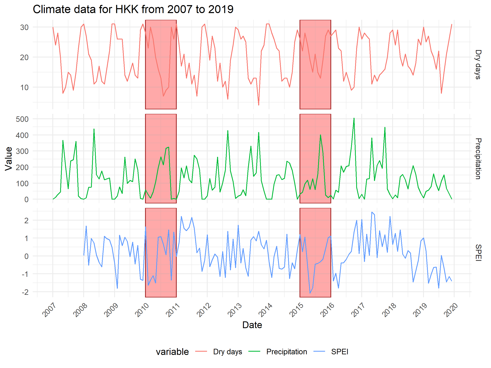
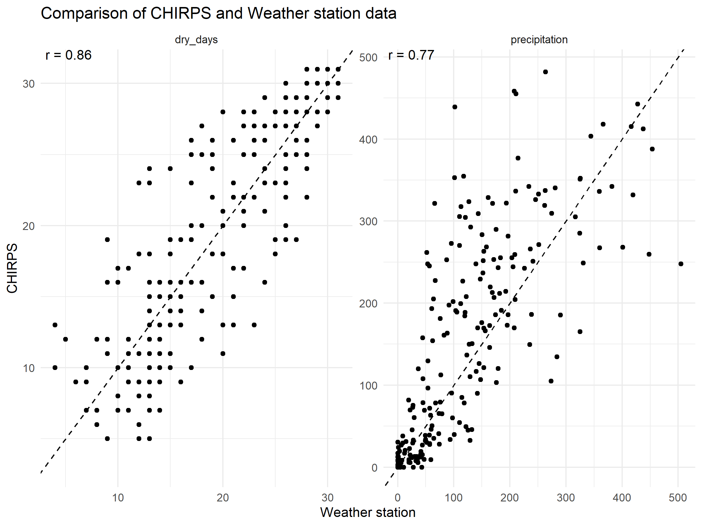

```{r setup, include=FALSE}
knitr::opts_chunk$set(echo = TRUE)

# Appendices

# SI table numbers

# SI table captions

# SI figure numbers

# SI figure captions


# https://github.com/EcoClimLab/Operations/blob/master/Data_Management-Scientific_Workflow/manuscript_prep_with_Rmd.md
```

```{r read files, echo=F}
# Read in files
```

\newpage

## Climate data and correlations






\newpage

## Data cleaning additional methods

\newpage

## Species traits and correlations

\newpage

## Individual model diagnostics

\newpage

