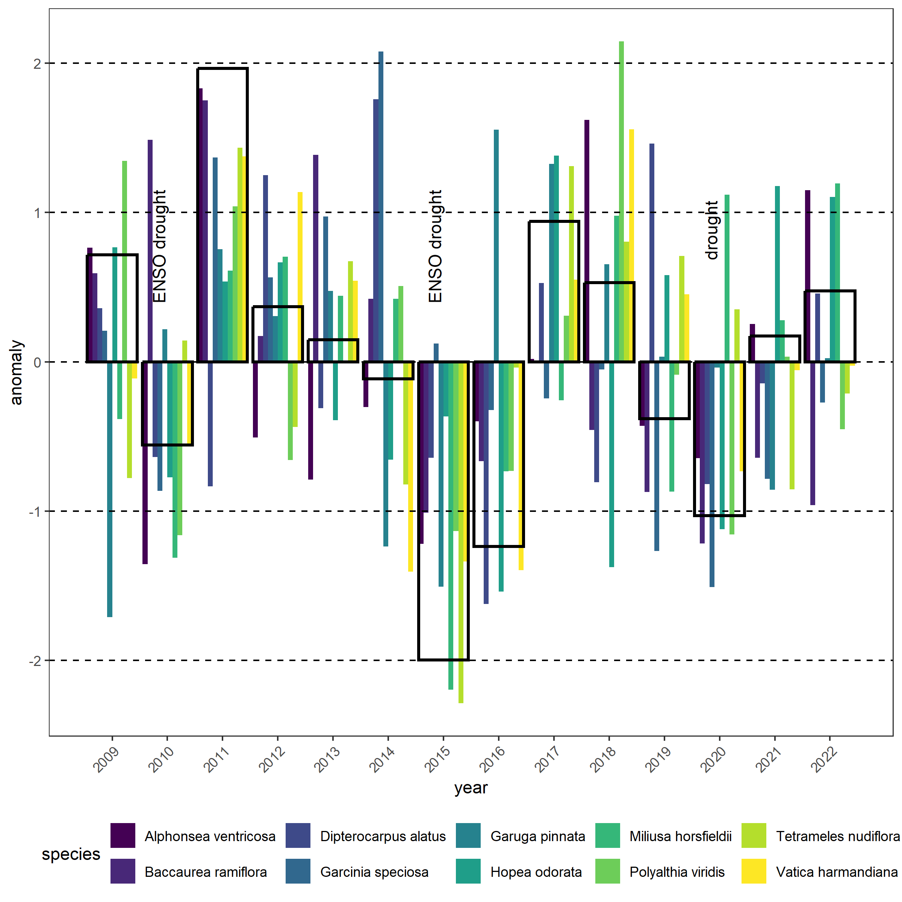
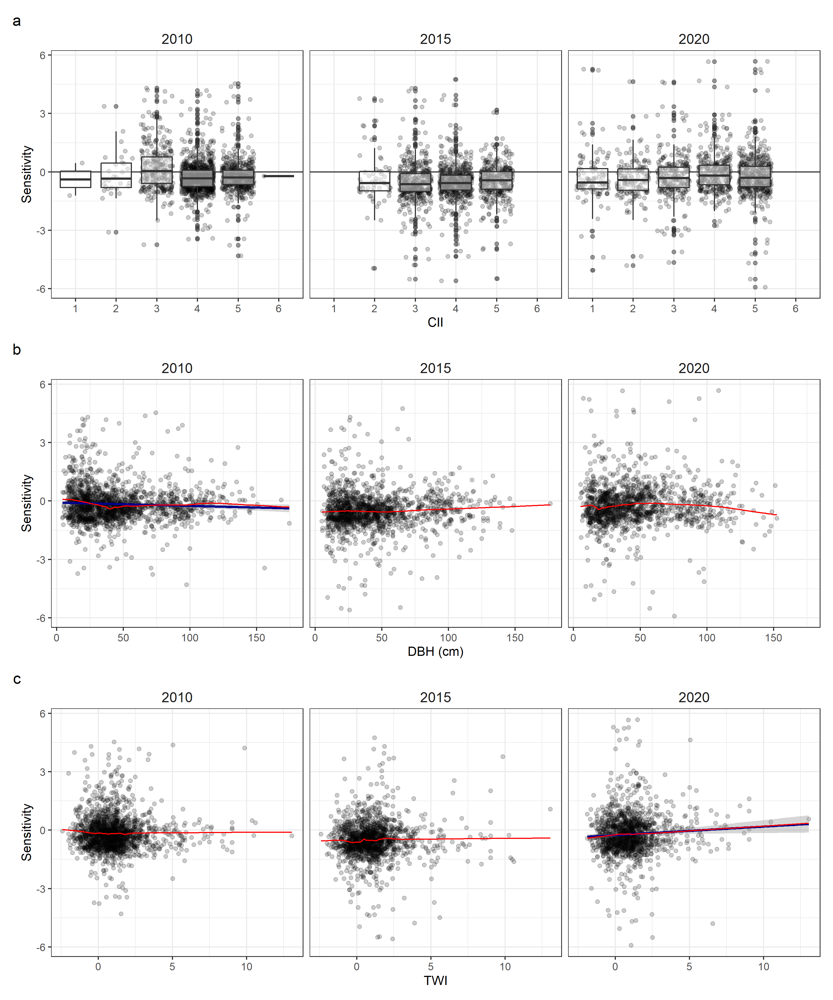
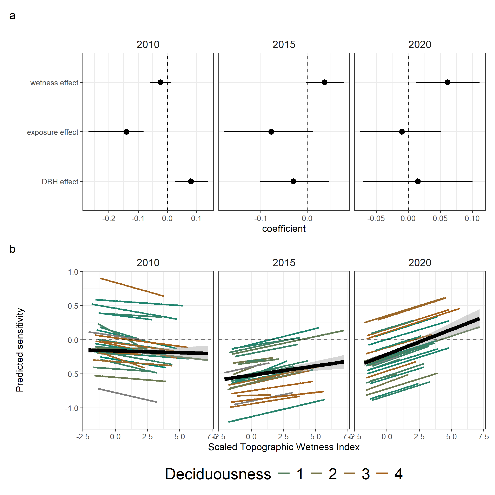

```{r setup, include=FALSE}
knitr::opts_chunk$set(echo = TRUE)

# Appendices

# SI table numbers

# SI table captions

# SI figure numbers

# SI figure captions


# https://github.com/EcoClimLab/Operations/blob/master/Data_Management-Scientific_Workflow/manuscript_prep_with_Rmd.md
```

**Authors**  
```{r eval = TRUE, echo=FALSE, warning=FALSE}
# library(flextable)
# set_flextable_defaults(font.family = "Arial", font.size = 9)
team <- read.csv("display/authors.csv", stringsAsFactors = FALSE, check.names = FALSE)

# team <- read.csv("doc/display/authors.csv", stringsAsFactors = FALSE, check.names = FALSE)

# ft <- flextable(team)
# ft <- line_spacing(ft, space = 1, part = "all")
# ft <- autofit(ft)
# ft <- width(ft, 1, width = 1.75)
# ft <- width(ft, 2, width = 1.75)
# ft <- width(ft, 3, width = 3)
# ft
```

Krishna Anujan^1,2^*  ORCiD: `r team$ORCID[1]`  
Sean McMahon^2,3^  ORCiD: `r team$ORCID[2]`  
Sarayudh Bunyavejchewin^4^  ORCiD: `r team$ORCID[3]`  
Stuart J. Davies^3^  ORCiD: `r team$ORCID[4]`  
Helene C. Muller-Landau^3^  ORCiD : `r team$ORCID[5]`  
Nantachai Pongpattananurak^5^  ORCiD: `r team$ORCID[6]`  
Kristina Anderson-Teixeira^1,3^  ORCiD: `r team$ORCID[7]`  


```{r read files, echo=F}
# Read in files

# figure numbers


# figure titles
```

\newpage

## Study site


\newpage

## Climate data and correlations


\newpage

## Data cleaning additional methods

<!-- - Data cleaning steps -->
For raw measurements of dendrometer band window size, we conducted QAQC steps as follows:
1. Removed potentially misidentified individuals. We removed individuals with conflicting metadata on tag or location across censuses. We did not remove individuals with conflicting species identification because these are often updated during the ForestGEO censuses. Therefore, we used the latest version of species identification for each tag shared by the PIs of the HKK plot.
2. Removed potential misidentified bands. Each new dendroband installed on a tree is numbered sequentially starting from 1. We removed any measurements made on bands old bands after a new band series had begun. 
3. Removing measurements that appeared likely to be data entry errors. We identified misplaced decimals by checking if the ratio between adjacent window size measurements were closer to 1 or 10 or 100. We removed measurements that had ratios closer to 10 or 100 than 1, assuming that these were likely misplaced decimals.

After calculating DBH from window size measurements and calculating annualised growth increments, we conducted further QAQC on these increments to create the final dataset:
1. We excluded large measurement outliers, defined as > 3 standard deviations from the mean increment across all observations. 
2. We excluded trees with negative increments or increments close to zero over the whole timeseries of observations. These low growing trees may be indicative of stress or mortality, and likely to bias analysis of interannual growth variation. 
3. We used concurrent tape measurements on dendrobanded trees to flag likely errors. We calculated annualised increments from annual tape measurements made on each dendrobanded tree at each census, using similar methods as described for dendrometer bands. For each tree and year, we calculated the degree of deviation of these measurements from each other as the Euclidean distance from the 1:1 line. We found that 90% of the increments were within 5 mm of of deviation, which we retained as a high confidence dataset. We excluded the remaining 10% from the analysis, although we were unable to ascertain whether the discrepancy was because of errors in tape or dendroband measurements. 

\newpage

## Growth timeseries and anomalies



<!--  -->

\newpage

## Drought year growth of species and individuals


![**Figure S6:** Correlations of species sensitivities across the two years. The top-left panel shows correlation of species median sensitivities and Pearson's correlation coefficient in the 2010 and 2015, top right shows 2010 and 2020, and bottom left shows 2015 and 2020. Colour gradient represents deciduousness scale and dotted line is the 1:1 line. The bottom right panel shows how species drought sensitivites varies among the three years; the color scheme for droughts matches that in main text figure 1.](display/Fig_SI_sensitivity_cor_dec.png)

<!--  -->


**Table S1: Species characteristics and their median sensitivities** for the three drought years. Species characteristics reported include accepted scientific names of species analysed, their ForestGEO codes, deciduousness values (amount of leaf loss at maximum) and IUCN status as accessed in September 2025. For each species, median growth sensitivity +/- standard deviation is reported across the individuals analysed in 2010, 2015, and 2020 - the three drought years considered. IUCN category codes - "EN" = Endangered, "VU" = Vulnerable, "LC" = Least Concern, "DD" = Data Deficient. Empty columns indicate species which were not part of the IUCN assessment. 

```{r summary table, echo=F, warning=F, message=F}
library(tidyverse)
library(here)
tree.time <- read.csv(here("data", "dendro", "sensitivity_dataset.csv"))
iucn <- read.csv(here("data", "dendro", "sp_iucn.csv"))

# make a species table for each year

sens_sp <- tree.time %>%
  filter(yr %in% c(2010, 2015, 2020)) %>%
  group_by(spfull, yr) %>%
  dplyr::summarise(
    sp = dplyr::first(Species),
    williams_dec = dplyr::first(williams_dec),
    n = n(),
    med_sens = round(median(sens.prop, na.rm = T), 2),
    sd_sens = round(sd(sens.prop, na.rm = T), 2)
  ) %>%
  ungroup()

sens_sp <- merge(sens_sp, iucn, by = "sp", all.x = T)

# head(sens_sp)
# make the column
sens_sp$sens <- paste0(sens_sp$med_sens, " +/- ", sens_sp$sd_sens)

# pivot wider by year

sens_sp <- sens_sp %>%
  dplyr::select(-med_sens, -sd_sens, -n) %>%
  pivot_wider(values_from = sens, names_from = yr) %>%
  dplyr::rename(
    deciduousness = williams_dec,
    "IUCN status" = iucn,
    "Species name" = spfull,
    "Species code" = sp
  )
# head(sens_sp)

knitr::kable(sens_sp)
```

\newpage

## Variables and their distributions


\newpage


## Raw sensitivity and residuals with predictors




\newpage

## Conditional dependencies 

To analyse the influence of microenvironmental variables on growth sensitivity, we first created a Directed Acyclic Graph describing the relationships. 
The consistency of the DAG with the dataset, and our ability build causally interpretable models, is conditional on the numerical independence among some specific variable groups, as implied by the DAG structure.
We identified these "testable implications" or "conditional independences" for this DAG using *dagitty* as CII $\perp\!\!\!\perp$ TWI and DBH $\perp\!\!\!\perp$ TWI.
We tested these correlations using the function *cor()* in R, with the simple criteria that a Pearson's correlation coefficient <0.3 implies independence among variable pairs and causal relevance of the DAG. 

  

There is low correlation between these two variable pairs across all individuals. We then tested conditional dependencies at the species level.

  


 
Most species (barring a few) had low correlation between these variables in our dataset, allowing us to proceed with analysis and interpretation.


\newpage

## Alternate models using Topographic Position Index

As an alternate measure of wetness to Topographic Wetness Index (TWI) that requires the total upslope area, we used Topographic Position Index (TPI), a localised convexity/concavity-based metric of water availability as a predictor.
We calculated TPI using the package *spatialEco* [@evans_spatialeco_2023] using a circular buffer window of 1, 3, 5 and 7 pixels. 
Larger window sizes while providing a smoother surface on the plot, clip out larger portions of the plot margin where the window might bleed outside. 
We chose to use the 5-pixel version because of the balance between smoothness across the landscape and data loss.  

TPI and TWI had better resolution in different parts of the wetness gradient, with TWI capturing larger resolution among wetter locations and TPI capturing larger resolution among drier locations. 
Interaction models of deciduousness with TPI showed qualitatively similar results with the TWI models across the three drought years.


Similarly, models accounting for DBH and CII showed similar directional effects of wetness whether TWI or TPI was used. 
Please note that left to right represents wet to dry, given the way that TPI is calculated.


\newpage

# Alternate model using species random effect only on intercept



\newpage

# Alternate models as causal inquiries following backdoor criteria

For an alterate approach, we used a backdoor criteria approach as used in causal inquiry to test the effects of DBH, CII and TWI on sensitivity separately starting from a combined DAG. 
First, we specificied the DAG on DAGitty [@textor_robust_2016] in the same strcuture as described in Fig 5 in the main text.
We then set sensitivity as the response variable, or "outcome".
For each variable - DBH, CII and TWI - whose causal effects we were interested in, we examined the minimum set of adjustment variables for each causal effect, by setting each of these as "exposure" one after the other and computing adjustment sets from DAGitty.
This resulted in three different models to test the total causal effects:

For TWI: $sensitivity \sim TWI$  
For CII: $sensitivity \sim CII$  
For DBH: $sensitivity \sim DBH + CII$

We fit three different models on *brms*, with normal priors for sensitivity, TWI and DBH and a monotonic prior for CII.
All models had a random effect of Species on both slopes and intercept. 
Results from the causal inquiries following backdoor criteria align very closely with the SEM-like Bayesian causal model.


<!-- ## Individual model diagnostics

To add: 

\newpage -->

<!-- ## Growth occurrence models

To add: zero growth models -->

# References {-}