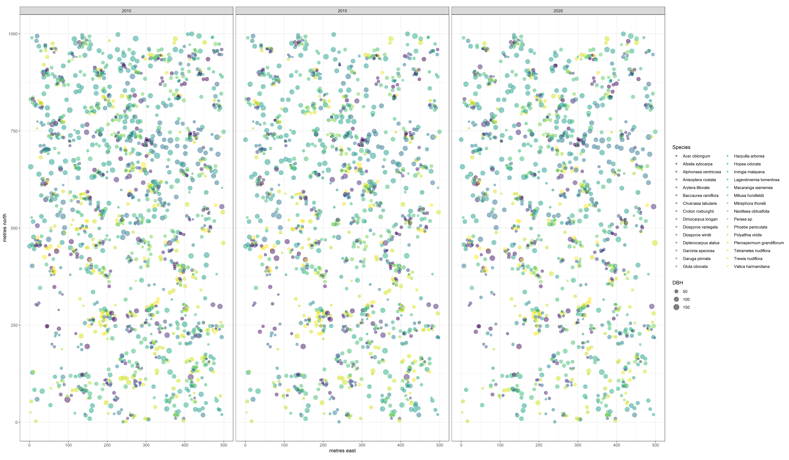
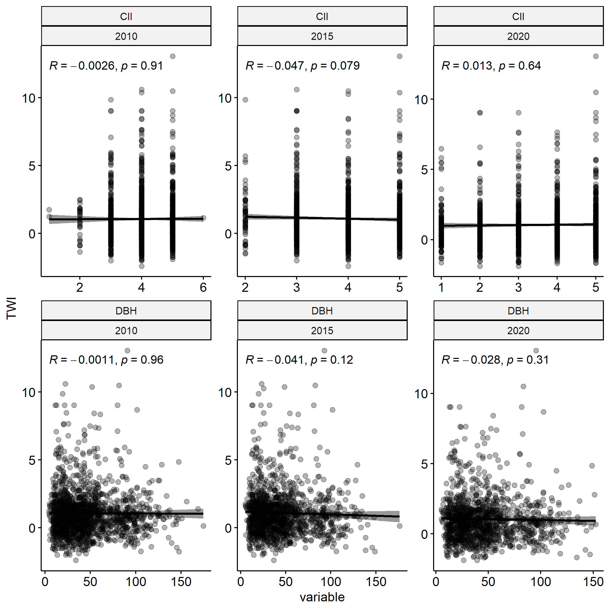

```{r setup, include=FALSE}
knitr::opts_chunk$set(echo = TRUE)

# Appendices

# SI table numbers

# SI table captions

# SI figure numbers

# SI figure captions


# https://github.com/EcoClimLab/Operations/blob/master/Data_Management-Scientific_Workflow/manuscript_prep_with_Rmd.md
```

**Authors**  
```{r eval = TRUE, echo=FALSE, warning=FALSE}
# library(flextable)
# set_flextable_defaults(font.family = "Arial", font.size = 9)
team <- read.csv("display/authors.csv", stringsAsFactors = FALSE, check.names = FALSE)

# team <- read.csv("doc/display/authors.csv", stringsAsFactors = FALSE, check.names = FALSE)

# ft <- flextable(team)
# ft <- line_spacing(ft, space = 1, part = "all")
# ft <- autofit(ft)
# ft <- width(ft, 1, width = 1.75)
# ft <- width(ft, 2, width = 1.75)
# ft <- width(ft, 3, width = 3)
# ft
```

Krishna Anujan^1,2^*  ORCiD: `r team$ORCID[1]`  
Sean McMahon^2,3^  ORCiD: `r team$ORCID[2]`  
Sarayudh Bunyavejchewin^4^  ORCiD: `r team$ORCID[3]`  
Stuart J. Davies^3^  ORCiD: `r team$ORCID[4]`  
Helene C. Muller-Landau^3^  ORCiD : `r team$ORCID[5]`  
Nantachai Pongpattananurak^5^  ORCiD: `r team$ORCID[6]`  
Kristina Anderson-Teixeira^1,3^  ORCiD: `r team$ORCID[7]`  


```{r read files, echo=F}
# Read in files

# figure numbers


# figure titles
```

\newpage

## Climate data and correlations


\newpage

## Data cleaning additional methods

<!-- - Data cleaning steps -->
For raw measurements of dendrometer band window size, we conducted QAQC steps as follows:
1. Removed potentially misidentified individuals. We removed individuals with conflicting metadata on tag or location across censuses. We did not remove individuals with conflicting species identification because these are often updated during the ForestGEO censuses. Therefore, we used the latest version of species identification for each tag shared by the PIs of the HKK plot.
2. Removed potential misidentified bands. Each new dendroband installed on a tree is numbered sequentially starting from 1. We removed any measurements made on bands old bands after a new band series had begun. 
3. Removing measurements that appeared likely to be data entry errors. We identified misplaced decimals by checking if the ratio between adjacent window size measurements were closer to 1 or 10 or 100. We removed measurements that had ratios closer to 10 or 100 than 1, assuming that these were likely misplaced decimals.

After calculating DBH from window size measurements and calculating annualised growth increments, we conducted further QAQC on these increments to create the final dataset:
1. We excluded large measurement outliers, defined as > 3 standard deviations from the mean increment across all observations. 
2. We excluded trees with negative increments or increments close to zero over the whole timeseries of observations. These low growing trees may be indicative of stress or mortality, and likely to bias analysis of interannual growth variation. 
3. We used concurrent tape measurements on dendrobanded trees to flag likely errors. We calculated annualised increments from annual tape measurements made on each dendrobanded tree at each census, using similar methods as described for dendrometer bands. For each tree and year, we calculated the degree of deviation of these measurements from each other as the Euclidean distance from the 1:1 line. We found that 90% of the increments were within 5 mm of of deviation, which we retained as a high confidence dataset. We excluded the remaining 10% from the analysis, although we were unable to ascertain whether the discrepancy was because of errors in tape or dendroband measurements. 

\newpage

## Growth timeseries and anomalies


<!--  -->

\newpage

## Drought year growth of species and individuals


<!--  -->


\newpage

## Variables and their distributions

Map of trees




\newpage

## Raw sensitivity and residuals with predictors


\newpage

## Conditional dependencies 

To analyse the influence of microenvironmental variables on growth sensitivity, we first created a Directed Acyclic Graph describing the relationships. To be able to test the DAG with the dataset, we used *dagitty* to derive the conditional dependencies that need to be tested, namely CII $\perp\!\!\!\perp$ TWI and DBH $\perp\!\!\!\perp$ TWI.

  

There is low correlation between these two variable pairs across all individuals. We then tested conditional dependencies at the species level.

  


 
Most species (barring a few) had low correlation between these variables in our dataset, allowing us to proceed with analysis and interpretation.


\newpage

## Alternate models using Topographic Position Index

As an alternate measure of wetness to Topographic Wetness Index (TWI) that requires the total upslope area, we used Topographic Position Index (TPI), a localised convexity/concavity-based metric of water availability as a predictor.
We calculated TPI using the package *spatialEco* [@evans_spatialeco_2023] using a circular buffer window of 1, 3, 5 and 7 pixels. 
Larger window sizes while providing a smoother surface on the plot, clip out larger portions of the plot margin where the window might bleed outside. 
We chose to use the 5-pixel version because of the balance between smoothness across the landscape and data loss.  

TPI and TWI had better resolution in different parts of the wetness gradient, with TWI capturing larger resolution among wetter locations and TPI capturing larger resolution among drier locations. 
Interaction models of deciduousness with TPI showed qualitatively similar results with the TWI models across the three drought years.


Similarly, models accounting for DBH and CII showed similar directional effects of wetness whether TWI or TPI was used. 
Please note that left to right represents wet to dry, given the way that TPI is calculated.


# Alternate model using species random effect only on intercept


<!-- ## Individual model diagnostics

To add: 

\newpage -->

<!-- ## Growth occurrence models

To add: zero growth models -->

# References {-}