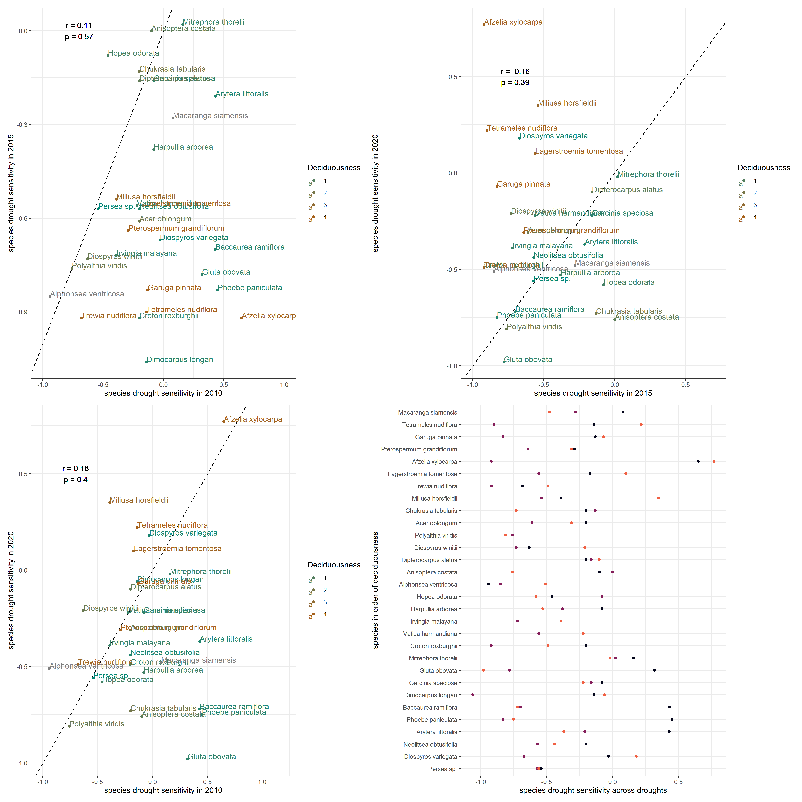

```{r setup, include=FALSE}
knitr::opts_chunk$set(echo = TRUE)

# Appendices

# SI table numbers

# SI table captions

# SI figure numbers

# SI figure captions


# https://github.com/EcoClimLab/Operations/blob/master/Data_Management-Scientific_Workflow/manuscript_prep_with_Rmd.md
```

**Authors**  
```{r eval = TRUE, echo=FALSE, warning=FALSE}
# library(flextable)
# set_flextable_defaults(font.family = "Arial", font.size = 9)
team <- read.csv("display/authors.csv", stringsAsFactors = FALSE, check.names = FALSE)

# team <- read.csv("doc/display/authors.csv", stringsAsFactors = FALSE, check.names = FALSE)

# ft <- flextable(team)
# ft <- line_spacing(ft, space = 1, part = "all")
# ft <- autofit(ft)
# ft <- width(ft, 1, width = 1.75)
# ft <- width(ft, 2, width = 1.75)
# ft <- width(ft, 3, width = 3)
# ft
```

Krishna Anujan^1,2^*  ORCiD: `r team$ORCID[1]`  
Sean McMahon^2,3^  ORCiD: `r team$ORCID[2]`  
Sarayudh Bunyavejchewin^4^  ORCiD: `r team$ORCID[3]`  
Stuart J. Davies^3^  ORCiD: `r team$ORCID[4]`  
Helene C. Muller-Landau^3^  ORCiD : `r team$ORCID[5]`  
Nantachai Pongpattananurak^5^  ORCiD: `r team$ORCID[6]`  
Kristina Anderson-Teixeira^1,3^  ORCiD: `r team$ORCID[7]`  


```{r read files, echo=F}
# Read in files

# figure numbers


# figure titles
```

\newpage

## Climate data and correlations


\newpage

## Data cleaning additional methods

- Data cleaning steps
- Calculating DBH equation
- Corroboration with tape measurements
- error distribution

\newpage

## Growth timeseries and anomalies


<!--  -->

## Drought year growth of species and individuals




<!--  -->


## Variables and their distributions

- locations of dendroband trees


- Conditional dependence of variables

\newpage

<!-- ## Individual model diagnostics

To add: 

\newpage -->

<!-- ## Growth occurrence models

To add: zero growth models -->